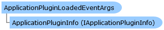

Collapse All Expand All Language Filter: All  Language Filter: Multiple  Language Filter: Visual Basic (Declaration) Language Filter: Visual Basic (Usage) Language Filter: C#  
---  
DriveWorks SDK Documentation  |   
---|---  
ApplicationPluginLoadedEventArgs Class   
[Members](topic2117.md)   
[DriveWorks.Applications Assembly](topic13.md) > [DriveWorks.Applications.Extensibility Namespace](topic1995.md) : ApplicationPluginLoadedEventArgs Class  
---  
  
Visual Basic (Declaration)    
Visual Basic (Usage)    
C# 

Glossary Item Box

Provides event data for the [IApplicationPluginManager.ApplicationPluginLoaded](topic2027.md) event. 

# Object Model

# Syntax

Visual Basic (Declaration)|   
---|---  
      
    
    Public Class ApplicationPluginLoadedEventArgs 
       Inherits System.EventArgs  
  
Visual Basic (Usage)| Copy Code  
---|---  
      
    
    Dim instance As [ApplicationPluginLoadedEventArgs](topic2116.md)  
  
C#|   
---|---  
      
    
    public class ApplicationPluginLoadedEventArgs : System.EventArgs   
  
# Inheritance Hierarchy

System.Object  
System.EventArgs  
**DriveWorks.Applications.Extensibility.ApplicationPluginLoadedEventArgs**  

# Requirements

**Target Platforms:** Please see DriveWorks software prerequisites.

# See Also

#### Reference

[ApplicationPluginLoadedEventArgs Members](topic2117.md)   
[DriveWorks.Applications.Extensibility Namespace](topic1995.md)

