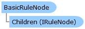

Collapse All Expand All Language Filter: All  Language Filter: Multiple  Language Filter: Visual Basic (Declaration) Language Filter: Visual Basic (Usage) Language Filter: C#  
---  
DriveWorks SDK Documentation  |   
---|---  
BasicRuleNode Class   
[Members](topic10559.md)   
[DriveWorks.Engine Assembly](topic2156.md) > [DriveWorks.Rules Namespace](topic10510.md) : BasicRuleNode Class  
---  
  
Visual Basic (Declaration)    
Visual Basic (Usage)    
C# 

Glossary Item Box

Provides a basic implementation of [IRuleNode](topic10542.md)

# Object Model

# Syntax

Visual Basic (Declaration)|   
---|---  
      
    
    Public Class BasicRuleNode 
       Implements [IRuleNode](topic10542.md)   
  
Visual Basic (Usage)| Copy Code  
---|---  
      
    
    Dim instance As [BasicRuleNode](topic10558.md)  
  
C#|   
---|---  
      
    
    public class BasicRuleNode : [IRuleNode](topic10542.md)    
  
# Inheritance Hierarchy

System.Object  
**DriveWorks.Rules.BasicRuleNode**  

# Requirements

**Target Platforms:** Please see DriveWorks software prerequisites.

# See Also

#### Reference

[BasicRuleNode Members](topic10559.md)   
[DriveWorks.Rules Namespace](topic10510.md)

