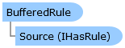

Collapse All Expand All Language Filter: All  Language Filter: Multiple  Language Filter: Visual Basic (Declaration) Language Filter: Visual Basic (Usage) Language Filter: C#  
---  
DriveWorks SDK Documentation  |   
---|---  
BufferedRule Class   
[Members](topic6018.md)   
[DriveWorks.Engine Assembly](topic2156.md) > [DriveWorks.Abstractions Namespace](topic5939.md) : BufferedRule Class  
---  
  
Visual Basic (Declaration)    
Visual Basic (Usage)    
C# 

Glossary Item Box

Provides an implementation of the [IHasRule](topic5947.md) implementation which acts as a buffer between a rule, and a rule consumer. 

# Object Model

# Syntax

Visual Basic (Declaration)|   
---|---  
      
    
    Public Class BufferedRule 
       Implements [IHasRule](topic5947.md), [IHasRuleId](topic5957.md), [IHasRuleType](topic5969.md), [DriveWorks.IHasRuleContext](topic2237.md)   
  
Visual Basic (Usage)| Copy Code  
---|---  
      
    
    Dim instance As [BufferedRule](topic6017.md)  
  
C#|   
---|---  
      
    
    public class BufferedRule : [IHasRule](topic5947.md), [IHasRuleId](topic5957.md), [IHasRuleType](topic5969.md), [DriveWorks.IHasRuleContext](topic2237.md)    
  
# Inheritance Hierarchy

System.Object  
**DriveWorks.Abstractions.BufferedRule**  
[DriveWorks.Abstractions.BufferedRuleWithVersionHistory](topic6035.md)  

# Requirements

**Target Platforms:** Please see DriveWorks software prerequisites.

# See Also

#### Reference

[BufferedRule Members](topic6018.md)   
[DriveWorks.Abstractions Namespace](topic5939.md)

