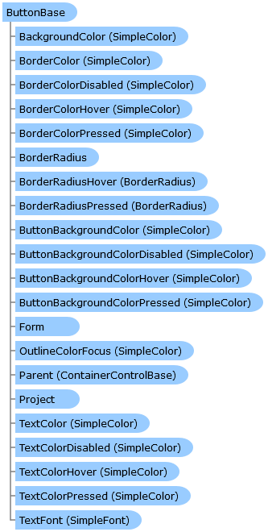

       

 Collapse All Expand All  Language Filter: All  Language Filter: Multiple  Language Filter: Visual Basic (Declaration) Language Filter: Visual Basic (Usage) Language Filter: C#  
---  
DriveWorks SDK Documentation  |   
---|---  
ButtonBase Class   
[Members](topic7339.md) See Also [Send Feedback](mailto:apisupport@driveworks.co.uk?subject=Documentation Feedback: topic7338.md)  
[DriveWorks.Engine Assembly](topic2156.md) > [DriveWorks.Forms Namespace](topic7266.md) : ButtonBase Class  
---  
  
Visual Basic (Declaration)    
Visual Basic (Usage)    
C# 

Glossary Item Box

Provides a base for button controls in DriveWorks. 

# Object Model

# Syntax

Visual Basic (Declaration)|   
---|---  
      
    
    Public MustInherit Class ButtonBase 
       Inherits [ControlBase](topic7698.md)
       Implements [DriveWorks.Extensibility.IExtension](topic7152.md)   
  
Visual Basic (Usage)| Copy Code  
---|---  
      
    
    Dim instance As [ButtonBase](topic7338.md)  
  
C#|   
---|---  
      
    
    public abstract class ButtonBase : [ControlBase](topic7698.md), [DriveWorks.Extensibility.IExtension](topic7152.md)    
  
# Inheritance Hierarchy

System.Object  
System.MarshalByRefObject  
[DriveWorks.Forms.ControlBase](topic7698.md)  
**DriveWorks.Forms.ButtonBase**  
[DriveWorks.Forms.ClipboardButton](topic7606.md)  
[DriveWorks.Forms.DialogButton](topic8051.md)  
[DriveWorks.Forms.MacroButton](topic8340.md)  
[DriveWorks.Forms.UploadControl](topic9323.md)  

# Requirements

**Target Platforms:** Please see DriveWorks software prerequisites.

# See Also

#### Reference

[ButtonBase Members](topic7339.md)   
[DriveWorks.Forms Namespace](topic7266.md)

©2024 DriveWorks Ltd. All Rights Reserved.
