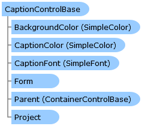

       

 Collapse All Expand All  Language Filter: All  Language Filter: Multiple  Language Filter: Visual Basic (Declaration) Language Filter: Visual Basic (Usage) Language Filter: C#  
---  
DriveWorks SDK Documentation  |   
---|---  
CaptionControlBase Class   
[Members](topic7391.md) See Also [Send Feedback](mailto:apisupport@driveworks.co.uk?subject=Documentation Feedback: topic7390.md)  
[DriveWorks.Engine Assembly](topic2156.md) > [DriveWorks.Forms Namespace](topic7266.md) : CaptionControlBase Class  
---  
  
Visual Basic (Declaration)    
Visual Basic (Usage)    
C# 

Glossary Item Box

Provides a base class for controls which have a caption. 

# Object Model

# Syntax

Visual Basic (Declaration)|   
---|---  
      
    
    Public MustInherit Class CaptionControlBase 
       Inherits [ControlBase](topic7698.md)
       Implements [DriveWorks.Extensibility.IExtension](topic7152.md)   
  
Visual Basic (Usage)| Copy Code  
---|---  
      
    
    Dim instance As [CaptionControlBase](topic7390.md)  
  
C#|   
---|---  
      
    
    public abstract class CaptionControlBase : [ControlBase](topic7698.md), [DriveWorks.Extensibility.IExtension](topic7152.md)    
  
# Inheritance Hierarchy

System.Object  
System.MarshalByRefObject  
[DriveWorks.Forms.ControlBase](topic7698.md)  
**DriveWorks.Forms.CaptionControlBase**  
[DriveWorks.Forms.CheckBox](topic7410.md)  
[DriveWorks.Forms.CheckBoxGroup](topic7474.md)  
[DriveWorks.Forms.ChildSpecificationList](topic7547.md)  
[DriveWorks.Forms.DataGrid](topic7838.md)  
[DriveWorks.Forms.DatePicker](topic7958.md)  
[DriveWorks.Forms.ItemList](topic8183.md)  
[DriveWorks.Forms.ListControlBase](topic8315.md)  
[DriveWorks.Forms.MeasurementTextBox](topic8364.md)  
[DriveWorks.Forms.NumericTextBox](topic8474.md)  
[DriveWorks.Forms.OptionButton](topic8549.md)  
[DriveWorks.Forms.SpinButton](topic9002.md)  
[DriveWorks.Forms.TextBox](topic9121.md)  
[DriveWorks.Forms.ToggleSwitch](topic9266.md)  

# Requirements

**Target Platforms:** Please see DriveWorks software prerequisites.

# See Also

#### Reference

[CaptionControlBase Members](topic7391.md)   
[DriveWorks.Forms Namespace](topic7266.md)

©2024 DriveWorks Ltd. All Rights Reserved.
