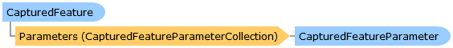

Collapse All Expand All Language Filter: All  Language Filter: Multiple  Language Filter: Visual Basic (Declaration) Language Filter: Visual Basic (Usage) Language Filter: C#  
---  
DriveWorks SDK Documentation  |   
---|---  
CapturedFeature Class   
[Members](topic14192.md)   
[DriveWorks.SolidWorks Assembly](topic13342.md) > [DriveWorks.SolidWorks.Components Namespace](topic13925.md) : CapturedFeature Class  
---  
  
Visual Basic (Declaration)    
Visual Basic (Usage)    
C# 

Glossary Item Box

Represents a captured feature in an assembly or part. 

# Object Model

# Syntax

Visual Basic (Declaration)|   
---|---  
      
    
    Public Class CapturedFeature   
  
Visual Basic (Usage)| Copy Code  
---|---  
      
    
    Dim instance As [CapturedFeature](topic14191.md)  
  
C#|   
---|---  
      
    
    public class CapturedFeature   
  
# Inheritance Hierarchy

System.Object  
**DriveWorks.SolidWorks.Components.CapturedFeature**  

# Requirements

**Target Platforms:** Please see DriveWorks software prerequisites.

# See Also

#### Reference

[CapturedFeature Members](topic14192.md)   
[DriveWorks.SolidWorks.Components Namespace](topic13925.md)

