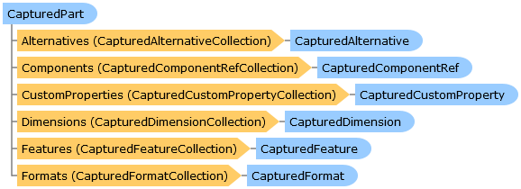

Collapse All Expand All Language Filter: All  Language Filter: Multiple  Language Filter: Visual Basic (Declaration) Language Filter: Visual Basic (Usage) Language Filter: C#  
---  
DriveWorks SDK Documentation  |   
---|---  
CapturedPart Class   
[Members](topic14308.md)   
[DriveWorks.SolidWorks Assembly](topic13342.md) > [DriveWorks.SolidWorks.Components Namespace](topic13925.md) : CapturedPart Class  
---  
  
Visual Basic (Declaration)    
Visual Basic (Usage)    
C# 

Glossary Item Box

Represents a captured SolidWorks part. 

# Object Model

# Syntax

Visual Basic (Declaration)|   
---|---  
      
    
    <[ComponentFactoryAttribute](topic6167.md)(DriveWorks.SolidWorks.Components.PartFactory)>
    Public Class CapturedPart 
       Inherits [CapturedSolidWorksComponent](topic14343.md)
       Implements [DriveWorks.Components.IHasReferences](topic6099.md), [IHasCapturedAlternatives](topic13927.md), [IHasCapturedCustomProperties](topic13933.md), [IHasCapturedDimensions](topic13939.md), [IHasCapturedFeatures](topic13945.md), [IHasCapturedFormats](topic13951.md), [IHasCapturedReferences](topic13957.md)   
  
Visual Basic (Usage)| Copy Code  
---|---  
      
    
    Dim instance As [CapturedPart](topic14307.md)  
  
C#|   
---|---  
      
    
    [[ComponentFactoryAttribute](topic6167.md)(DriveWorks.SolidWorks.Components.PartFactory)]
    public class CapturedPart : [CapturedSolidWorksComponent](topic14343.md), [DriveWorks.Components.IHasReferences](topic6099.md), [IHasCapturedAlternatives](topic13927.md), [IHasCapturedCustomProperties](topic13933.md), [IHasCapturedDimensions](topic13939.md), [IHasCapturedFeatures](topic13945.md), [IHasCapturedFormats](topic13951.md), [IHasCapturedReferences](topic13957.md)    
  
# Inheritance Hierarchy

System.Object  
System.MarshalByRefObject  
[DriveWorks.Components.CapturedComponent](topic6147.md)  
[DriveWorks.SolidWorks.Components.CapturedSolidWorksComponent](topic14343.md)  
**DriveWorks.SolidWorks.Components.CapturedPart**  

# Requirements

**Target Platforms:** Please see DriveWorks software prerequisites.

# See Also

#### Reference

[CapturedPart Members](topic14308.md)   
[DriveWorks.SolidWorks.Components Namespace](topic13925.md)

