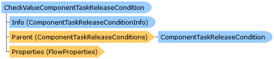

       

 Collapse All Expand All  Language Filter: All  Language Filter: Multiple  Language Filter: Visual Basic (Declaration) Language Filter: Visual Basic (Usage) Language Filter: C#  
---  
DriveWorks SDK Documentation  |   
---|---  
CheckValueComponentTaskReleaseCondition Class   
[Members](topic6738.md)   
[DriveWorks.Engine Assembly](topic2156.md) > [DriveWorks.Components.Tasks.StandardConditions Namespace](topic6735.md) : CheckValueComponentTaskReleaseCondition Class  
---  
  
Visual Basic (Declaration)    
Visual Basic (Usage)    
C# 

Glossary Item Box

A component task condition which determines whether the value entered is TRUE/YES/1. 

# Object Model

# Syntax

Visual Basic (Declaration)|   
---|---  
      
    
    <[ComponentTaskConditionAttribute](topic6512.md)(Title="resx://DriveWorks.ConditionsLocalizedResources,ConditionDispNameCheckValueCondition", 
       Description="resx://DriveWorks.ConditionsLocalizedResources,ConditionDescriptionCheckValue", 
       Image="embedded://DriveWorks.CheckValueConditionPlain16.png", 
       Category="resx://DriveWorks.ConditionsLocalizedResources,ConditionCategoryGeneral", 
       AllowedLocations=ComponentTaskSequenceLocation.PreCopy Or  _
        ComponentTaskSequenceLocation.PostCopy Or  _
        ComponentTaskSequenceLocation.Before Or  _
        ComponentTaskSequenceLocation.After Or  _
        ComponentTaskSequenceLocation.PostClose Or  _
        ComponentTaskSequenceLocation.PreClose Or  _
        ComponentTaskSequenceLocation.All)>
    Public Class CheckValueComponentTaskReleaseCondition 
       Inherits [DriveWorks.Components.Tasks.ComponentTaskReleaseCondition](topic6647.md)
       Implements [DriveWorks.Extensibility.IExtension](topic7152.md)   
  
Visual Basic (Usage)| Copy Code  
---|---  
      
    
    Dim instance As [CheckValueComponentTaskReleaseCondition](topic6737.md)  
  
C#|   
---|---  
      
    
    [[ComponentTaskConditionAttribute](topic6512.md)(Title="resx://DriveWorks.ConditionsLocalizedResources,ConditionDispNameCheckValueCondition", 
       Description="resx://DriveWorks.ConditionsLocalizedResources,ConditionDescriptionCheckValue", 
       Image="embedded://DriveWorks.CheckValueConditionPlain16.png", 
       Category="resx://DriveWorks.ConditionsLocalizedResources,ConditionCategoryGeneral", 
       AllowedLocations=ComponentTaskSequenceLocation.PreCopy | 
        ComponentTaskSequenceLocation.PostCopy | 
        ComponentTaskSequenceLocation.Before | 
        ComponentTaskSequenceLocation.After | 
        ComponentTaskSequenceLocation.PostClose | 
        ComponentTaskSequenceLocation.PreClose | 
        ComponentTaskSequenceLocation.All)]
    public class CheckValueComponentTaskReleaseCondition : [DriveWorks.Components.Tasks.ComponentTaskReleaseCondition](topic6647.md), [DriveWorks.Extensibility.IExtension](topic7152.md)    
  
# Inheritance Hierarchy

System.Object  
System.MarshalByRefObject  
[DriveWorks.Components.Tasks.ComponentTaskReleaseCondition](topic6647.md)  
**DriveWorks.Components.Tasks.StandardConditions.CheckValueComponentTaskReleaseCondition**  

# Requirements

**Target Platforms:** Please see DriveWorks software prerequisites.

# See Also

#### Reference

[CheckValueComponentTaskReleaseCondition Members](topic6738.md)   
[DriveWorks.Components.Tasks.StandardConditions Namespace](topic6735.md)

