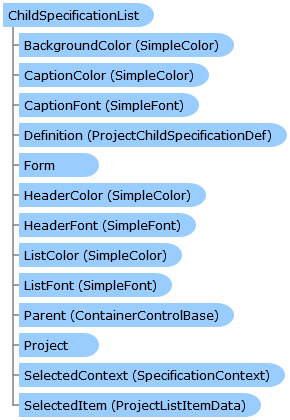

Collapse All Expand All Language Filter: All  Language Filter: Multiple  Language Filter: Visual Basic (Declaration) Language Filter: Visual Basic (Usage) Language Filter: C#  
---  
DriveWorks SDK Documentation  |   
---|---  
ChildSpecificationList Class   
[Members](topic7548.md)   
[DriveWorks.Engine Assembly](topic2156.md) > [DriveWorks.Forms Namespace](topic7266.md) : ChildSpecificationList Class  
---  
  
Visual Basic (Declaration)    
Visual Basic (Usage)    
C# 

Glossary Item Box

Implements a child specification list control (known as the subproject control in DriveWorks 6). 

# Object Model

# Syntax

Visual Basic (Declaration)|   
---|---  
      
    
    <[DefaultSizeAttribute](topic8042.md)(Width=500, Height=200)>
    Public Class ChildSpecificationList 
       Inherits [CaptionControlBase](topic7390.md)
       Implements [DriveWorks.Extensibility.IExtension](topic7152.md), [DriveWorks.Specification.StandardTasks.ICopySpecificationHostService](topic11898.md)   
  
Visual Basic (Usage)| Copy Code  
---|---  
      
    
    Dim instance As [ChildSpecificationList](topic7547.md)  
  
C#|   
---|---  
      
    
    [[DefaultSizeAttribute](topic8042.md)(Width=500, Height=200)]
    public class ChildSpecificationList : [CaptionControlBase](topic7390.md), [DriveWorks.Extensibility.IExtension](topic7152.md), [DriveWorks.Specification.StandardTasks.ICopySpecificationHostService](topic11898.md)    
  
# Remarks

The child specification list control allows specifications to be nested. An example of a situation in which you might want to do this is if you have multiple independent product lines which need specifying for a single given order. In this case, you could create a 'Contract' project, with a child specification list control on one of its forms that allows you to add specifications based on other projects for each product line.

# Inheritance Hierarchy

System.Object  
System.MarshalByRefObject  
[DriveWorks.Forms.ControlBase](topic7698.md)  
[DriveWorks.Forms.CaptionControlBase](topic7390.md)  
**DriveWorks.Forms.ChildSpecificationList**  

# Requirements

**Target Platforms:** Please see DriveWorks software prerequisites.

# See Also

#### Reference

[ChildSpecificationList Members](topic7548.md)   
[DriveWorks.Forms Namespace](topic7266.md)

