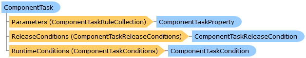

       

 Collapse All Expand All  Language Filter: All  Language Filter: Multiple  Language Filter: Visual Basic (Declaration) Language Filter: Visual Basic (Usage) Language Filter: C#  
---  
DriveWorks SDK Documentation  |   
---|---  
ComponentTask Class   
[Members](topic6408.md)   
[DriveWorks.Engine Assembly](topic2156.md) > [DriveWorks.Components.Tasks Namespace](topic6391.md) : ComponentTask Class  
---  
  
Visual Basic (Declaration)    
Visual Basic (Usage)    
C# 

Glossary Item Box

Represents a component task that has been added to the project. 

# Object Model

# Syntax

Visual Basic (Declaration)|   
---|---  
      
    
    <DebuggerDisplayAttribute(Value="[{Index}] {Name}", 
       Name="", 
       Type="", 
       Target=, 
       TargetTypeName="")>
    Public Class ComponentTask 
       Inherits DriveWorks.DomainObject  
  
Visual Basic (Usage)| Copy Code  
---|---  
      
    
    Dim instance As [ComponentTask](topic6407.md)  
  
C#|   
---|---  
      
    
    [DebuggerDisplayAttribute(Value="[{Index}] {Name}", 
       Name="", 
       Type="", 
       Target=, 
       TargetTypeName="")]
    public class ComponentTask : DriveWorks.DomainObject   
  
# Inheritance Hierarchy

System.Object  
System.MarshalByRefObject  
**DriveWorks.Components.Tasks.ComponentTask**  

# Requirements

**Target Platforms:** Please see DriveWorks software prerequisites.

# See Also

#### Reference

[ComponentTask Members](topic6408.md)   
[DriveWorks.Components.Tasks Namespace](topic6391.md)

