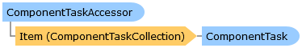

Collapse All Expand All Language Filter: All  Language Filter: Multiple  Language Filter: Visual Basic (Declaration) Language Filter: Visual Basic (Usage) Language Filter: C#  
---  
DriveWorks SDK Documentation  |   
---|---  
ComponentTaskAccessor Class   
[Members](topic6430.md)   
[DriveWorks.Engine Assembly](topic2156.md) > [DriveWorks.Components.Tasks Namespace](topic6391.md) : ComponentTaskAccessor Class  
---  
  
Visual Basic (Declaration)    
Visual Basic (Usage)    
C# 

Glossary Item Box

Provides access to the [ComponentTask](topic6407.md)s for a component or type of component. 

# Object Model

# Syntax

Visual Basic (Declaration)|   
---|---  
      
    
    <DefaultMemberAttribute("Item")>
    Public MustInherit Class ComponentTaskAccessor   
  
Visual Basic (Usage)| Copy Code  
---|---  
      
    
    Dim instance As [ComponentTaskAccessor](topic6429.md)  
  
C#|   
---|---  
      
    
    [DefaultMemberAttribute("Item")]
    public abstract class ComponentTaskAccessor   
  
# Inheritance Hierarchy

System.Object  
**DriveWorks.Components.Tasks.ComponentTaskAccessor**  

# Requirements

**Target Platforms:** Please see DriveWorks software prerequisites.

# See Also

#### Reference

[ComponentTaskAccessor Members](topic6430.md)   
[DriveWorks.Components.Tasks Namespace](topic6391.md)

