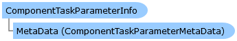

       

 Collapse All Expand All  Language Filter: All  Language Filter: Multiple  Language Filter: Visual Basic (Declaration) Language Filter: Visual Basic (Usage) Language Filter: C#  
---  
DriveWorks SDK Documentation  |   
---|---  
ComponentTaskParameterInfo Class   
[Members](topic6604.md)   
[DriveWorks.Engine Assembly](topic2156.md) > [DriveWorks.Components.Tasks Namespace](topic6391.md) : ComponentTaskParameterInfo Class  
---  
  
Visual Basic (Declaration)    
Visual Basic (Usage)    
C# 

Glossary Item Box

Represents the capturable parameters of a [IComponentTask](topic6393.md). 

# Object Model

# Syntax

Visual Basic (Declaration)|   
---|---  
      
    
    Public Class ComponentTaskParameterInfo 
       Inherits DriveWorks.DomainObject  
  
Visual Basic (Usage)| Copy Code  
---|---  
      
    
    Dim instance As [ComponentTaskParameterInfo](topic6603.md)  
  
C#|   
---|---  
      
    
    public class ComponentTaskParameterInfo : DriveWorks.DomainObject   
  
# Inheritance Hierarchy

System.Object  
System.MarshalByRefObject  
**DriveWorks.Components.Tasks.ComponentTaskParameterInfo**  

# Requirements

**Target Platforms:** Please see DriveWorks software prerequisites.

# See Also

#### Reference

[ComponentTaskParameterInfo Members](topic6604.md)   
[DriveWorks.Components.Tasks Namespace](topic6391.md)

