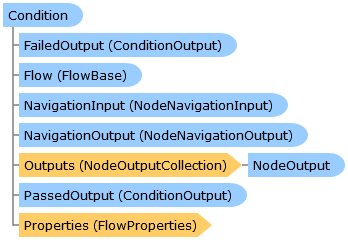

Collapse All Expand All Language Filter: All  Language Filter: Multiple  Language Filter: Visual Basic (Declaration) Language Filter: Visual Basic (Usage) Language Filter: C#  
---  
DriveWorks SDK Documentation  |   
---|---  
Condition Class   
[Members](topic10805.md) Example   
[DriveWorks.Engine Assembly](topic2156.md) > [DriveWorks.Specification Namespace](topic10764.md) : Condition Class  
---  
  
Visual Basic (Declaration)    
Visual Basic (Usage)    
C# 

Glossary Item Box

Represents a condition which governs the availability of an operation, task, or transition in a specification-flow. 

# Object Model

# Syntax

Visual Basic (Declaration)|   
---|---  
      
    
    Public MustInherit Class Condition 
       Inherits [DriveWorks.EventFlow.ExecutableNodeBase](topic6938.md)
       Implements [DriveWorks.EventFlow.IFlowNode](topic6873.md), [DriveWorks.Extensibility.IExtension](topic7152.md)   
  
Visual Basic (Usage)| Copy Code  
---|---  
      
    
    Dim instance As [Condition](topic10804.md)  
  
C#|   
---|---  
      
    
    public abstract class Condition : [DriveWorks.EventFlow.ExecutableNodeBase](topic6938.md), [DriveWorks.EventFlow.IFlowNode](topic6873.md), [DriveWorks.Extensibility.IExtension](topic7152.md)    
  
# Example

Visual Basic| Copy Code  
---|---  
      
    
    ' Import the Specification namespace so we have access to Specification flow
    Imports DriveWorks.Specification
     
    <Condition("My Condition", "embedded://MyTasksAndConditions.Puzzle-16x16.png")> _
    Public Class MyCondition
       Inherits Condition
     
       ' Register properties so DriveWorks can see them and build rules for them
       Private mMyProperty As FlowProperty(Of Boolean) = Me.Properties.RegisterBooleanProperty("Condition Result", "Specifies the result of the condition")
     
       Protected Overrides Function Evaluate(ByVal specificationContext As SpecificationContext) As Boolean
     
           ' Do something here to determine if the condition is met
           Return mMyProperty.Value
       End Function
    End Class  
  
# Inheritance Hierarchy

System.Object  
System.MarshalByRefObject  
[DriveWorks.EventFlow.ExecutableNodeBase](topic6938.md)  
**DriveWorks.Specification.Condition**  
[DriveWorks.Specification.StandardConditions.ApplicationTypeCondition](topic11830.md)  
[DriveWorks.Specification.StandardConditions.CanEditCompletedSpecificationsCondition](topic11837.md)  
[DriveWorks.Specification.StandardConditions.CheckValueCondition](topic11844.md)  
[DriveWorks.Specification.StandardConditions.DocumentGenerationBehaviorCondition](topic11851.md)  
[DriveWorks.Specification.StandardConditions.IsArchivedCondition](topic11858.md)  
[DriveWorks.Specification.StandardConditions.IsCancellingCondition](topic11864.md)  
[DriveWorks.Specification.StandardConditions.IsChildSpecificationCondition](topic11870.md)  
[DriveWorks.Specification.StandardConditions.ReleaseToAutoPilotCondition](topic11876.md)  
[DriveWorks.Specification.StandardConditions.SpecificationCompleteCondition](topic11883.md)  
[DriveWorks.Specification.StandardConditions.SpecificationTypeCondition](topic11889.md)  

# Requirements

**Target Platforms:** Please see DriveWorks software prerequisites.

# See Also

#### Reference

[Condition Members](topic10805.md)   
[DriveWorks.Specification Namespace](topic10764.md)

