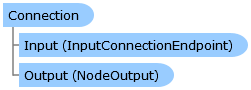

Collapse All Expand All Language Filter: All  Language Filter: Multiple  Language Filter: Visual Basic (Declaration) Language Filter: Visual Basic (Usage) Language Filter: C#  
---  
DriveWorks SDK Documentation  |   
---|---  
Connection Class   
[Members](topic6910.md)   
[DriveWorks.Engine Assembly](topic2156.md) > [DriveWorks.EventFlow Namespace](topic6871.md) : Connection Class  
---  
  
Visual Basic (Declaration)    
Visual Basic (Usage)    
C# 

Glossary Item Box

Represents a connection between one node's input and another node's output. 

# Object Model

# Syntax

Visual Basic (Declaration)|   
---|---  
      
    
    <DebuggerDisplayAttribute(Value="Connection {Output.Node.Name}:{Output.Name} -> {Input.Node.Name}:{Input.Name}", 
       Name="", 
       Type="", 
       Target=, 
       TargetTypeName="")>
    Public NotInheritable Class Connection   
  
Visual Basic (Usage)| Copy Code  
---|---  
      
    
    Dim instance As [Connection](topic6909.md)  
  
C#|   
---|---  
      
    
    [DebuggerDisplayAttribute(Value="Connection {Output.Node.Name}:{Output.Name} -> {Input.Node.Name}:{Input.Name}", 
       Name="", 
       Type="", 
       Target=, 
       TargetTypeName="")]
    public sealed class Connection   
  
# Inheritance Hierarchy

System.Object  
**DriveWorks.EventFlow.Connection**  

# Requirements

**Target Platforms:** Please see DriveWorks software prerequisites.

# See Also

#### Reference

[Connection Members](topic6910.md)   
[DriveWorks.EventFlow Namespace](topic6871.md)

