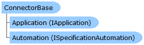

Collapse All Expand All Language Filter: All  Language Filter: Multiple  Language Filter: Visual Basic (Declaration) Language Filter: Visual Basic (Usage) Language Filter: C#  
---  
DriveWorks SDK Documentation  |   
---|---  
ConnectorBase Class   
[Members](topic1835.md)   
[DriveWorks.Applications Assembly](topic13.md) > [DriveWorks.Applications.Autopilot.Extensibility Namespace](topic1633.md) : ConnectorBase Class  
---  
  
Visual Basic (Declaration)    
Visual Basic (Usage)    
C# 

Glossary Item Box

Provides a base class to make implementing connectors easier. 

# Object Model

# Syntax

Visual Basic (Declaration)|   
---|---  
      
    
    Public MustInherit Class ConnectorBase 
       Implements [IConnector](topic1697.md), [DriveWorks.Applications.Extensibility.IApplicationPlugin](topic2004.md), [DriveWorks.Extensibility.IExtension](topic7152.md)   
  
Visual Basic (Usage)| Copy Code  
---|---  
      
    
    Dim instance As [ConnectorBase](topic1834.md)  
  
C#|   
---|---  
      
    
    public abstract class ConnectorBase : [IConnector](topic1697.md), [DriveWorks.Applications.Extensibility.IApplicationPlugin](topic2004.md), [DriveWorks.Extensibility.IExtension](topic7152.md)    
  
# Inheritance Hierarchy

System.Object  
**DriveWorks.Applications.Autopilot.Extensibility.ConnectorBase**  
[DriveWorks.Applications.Autopilot.Extensibility.PollingConnectorBase](topic1914.md)  

# Requirements

**Target Platforms:** Please see DriveWorks software prerequisites.

# See Also

#### Reference

[ConnectorBase Members](topic1835.md)   
[DriveWorks.Applications.Autopilot.Extensibility Namespace](topic1633.md)

