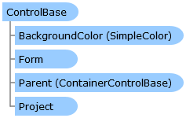

Collapse All Expand All Language Filter: All  Language Filter: Multiple  Language Filter: Visual Basic (Declaration) Language Filter: Visual Basic (Usage) Language Filter: C#  
---  
DriveWorks SDK Documentation  |   
---|---  
ControlBase Class   
[Members](topic7699.md)   
[DriveWorks.Engine Assembly](topic2156.md) > [DriveWorks.Forms Namespace](topic7266.md) : ControlBase Class  
---  
  
Visual Basic (Declaration)    
Visual Basic (Usage)    
C# 

Glossary Item Box

The base class for all controls. 

# Object Model

# Syntax

Visual Basic (Declaration)|   
---|---  
      
    
    <[DefaultRuleAttribute](topic8034.md)("=IF({0}="","",{0})")>
    <DebuggerDisplayAttribute(Value="{Name}", 
       Name="", 
       Type="", 
       Target=, 
       TargetTypeName="")>
    Public MustInherit Class ControlBase 
       Inherits DriveWorks.DomainObject
       Implements [DriveWorks.Extensibility.IExtension](topic7152.md)   
  
Visual Basic (Usage)| Copy Code  
---|---  
      
    
    Dim instance As [ControlBase](topic7698.md)  
  
C#|   
---|---  
      
    
    [[DefaultRuleAttribute](topic8034.md)("=IF({0}="","",{0})")]
    [DebuggerDisplayAttribute(Value="{Name}", 
       Name="", 
       Type="", 
       Target=, 
       TargetTypeName="")]
    public abstract class ControlBase : DriveWorks.DomainObject, [DriveWorks.Extensibility.IExtension](topic7152.md)    
  
# Inheritance Hierarchy

System.Object  
System.MarshalByRefObject  
**DriveWorks.Forms.ControlBase**  
[DriveWorks.Forms.ButtonBase](topic7338.md)  
[DriveWorks.Forms.CaptionControlBase](topic7390.md)  
[DriveWorks.Forms.ContainerControlBase](topic7684.md)  
[DriveWorks.Forms.DataTableControl](topic7864.md)  
[DriveWorks.Forms.FrameControl](topic8112.md)  
[DriveWorks.Forms.Hyperlink](topic8126.md)  
[DriveWorks.Forms.Label](topic8235.md)  
[DriveWorks.Forms.PictureBox](topic8686.md)  
[DriveWorks.Forms.PreviewControl](topic8709.md)  
[DriveWorks.Forms.Slider](topic8900.md)  
[DriveWorks.Forms.SpecificationHostControl](topic8979.md)  
[DriveWorks.Forms.TinyMCEControl](topic9204.md)  
[DriveWorks.Forms.WebFrameControl](topic9356.md)  

# Requirements

**Target Platforms:** Please see DriveWorks software prerequisites.

# See Also

#### Reference

[ControlBase Members](topic7699.md)   
[DriveWorks.Forms Namespace](topic7266.md)

