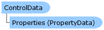

       

 Collapse All Expand All  Language Filter: All  Language Filter: Multiple  Language Filter: Visual Basic (Declaration) Language Filter: Visual Basic (Usage) Language Filter: C#  
---  
DriveWorks SDK Documentation  |   
---|---  
ControlData Class   
[Members](topic9594.md)   
[DriveWorks.Engine Assembly](topic2156.md) > [DriveWorks.Forms.DataModel.Serialization Namespace](topic9591.md) : ControlData Class  
---  
  
Visual Basic (Declaration)    
Visual Basic (Usage)    
C# 

Glossary Item Box

Provides the data required to build a control. 

# Object Model

# Syntax

Visual Basic (Declaration)|   
---|---  
      
    
    <DebuggerDisplayAttribute(Value="{Name}", 
       Name="", 
       Type="", 
       Target=, 
       TargetTypeName="")>
    <SerializableAttribute()>
    Public NotInheritable Class ControlData   
  
Visual Basic (Usage)| Copy Code  
---|---  
      
    
    Dim instance As [ControlData](topic9593.md)  
  
C#|   
---|---  
      
    
    [DebuggerDisplayAttribute(Value="{Name}", 
       Name="", 
       Type="", 
       Target=, 
       TargetTypeName="")]
    [SerializableAttribute()]
    public sealed class ControlData   
  
# Inheritance Hierarchy

System.Object  
**DriveWorks.Forms.DataModel.Serialization.ControlData**  

# Requirements

**Target Platforms:** Please see DriveWorks software prerequisites.

# See Also

#### Reference

[ControlData Members](topic9594.md)   
[DriveWorks.Forms.DataModel.Serialization Namespace](topic9591.md)

