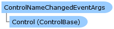

       

 Collapse All Expand All  Language Filter: All  Language Filter: Multiple  Language Filter: Visual Basic (Declaration) Language Filter: Visual Basic (Usage) Language Filter: C#  
---  
DriveWorks SDK Documentation  |   
---|---  
ControlNameChangedEventArgs Class   
[Members](topic10117.md)   
[DriveWorks.Engine Assembly](topic2156.md) > [DriveWorks.Navigation Namespace](topic10114.md) : ControlNameChangedEventArgs Class  
---  
  
Visual Basic (Declaration)    
Visual Basic (Usage)    
C# 

Glossary Item Box

Provides the event data for events raised when the name of a control changes. 

# Object Model

# Syntax

Visual Basic (Declaration)|   
---|---  
      
    
    Public Class ControlNameChangedEventArgs   
  
Visual Basic (Usage)| Copy Code  
---|---  
      
    
    Dim instance As [ControlNameChangedEventArgs](topic10116.md)  
  
C#|   
---|---  
      
    
    public class ControlNameChangedEventArgs   
  
# Inheritance Hierarchy

System.Object  
**DriveWorks.Navigation.ControlNameChangedEventArgs**  

# Requirements

**Target Platforms:** Please see DriveWorks software prerequisites.

# See Also

#### Reference

[ControlNameChangedEventArgs Members](topic10117.md)   
[DriveWorks.Navigation Namespace](topic10114.md)

