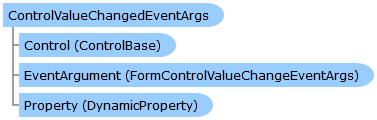

Collapse All Expand All Language Filter: All  Language Filter: Multiple  Language Filter: Visual Basic (Declaration) Language Filter: Visual Basic (Usage) Language Filter: C#  
---  
DriveWorks SDK Documentation  |   
---|---  
ControlValueChangedEventArgs Class   
[Members](topic9386.md)   
[DriveWorks.Engine Assembly](topic2156.md) > [DriveWorks.Forms.DataModel Namespace](topic9371.md) : ControlValueChangedEventArgs Class  
---  
  
Visual Basic (Declaration)    
Visual Basic (Usage)    
C# 

Glossary Item Box

Provides event data for the [ControlValueChangedEventHandler](topic9588.md) event. 

# Object Model

# Syntax

Visual Basic (Declaration)|   
---|---  
      
    
    <SerializableAttribute()>
    Public NotInheritable Class ControlValueChangedEventArgs 
       Inherits System.EventArgs  
  
Visual Basic (Usage)| Copy Code  
---|---  
      
    
    Dim instance As [ControlValueChangedEventArgs](topic9385.md)  
  
C#|   
---|---  
      
    
    [SerializableAttribute()]
    public sealed class ControlValueChangedEventArgs : System.EventArgs   
  
# Inheritance Hierarchy

System.Object  
System.EventArgs  
**DriveWorks.Forms.DataModel.ControlValueChangedEventArgs**  

# Requirements

**Target Platforms:** Please see DriveWorks software prerequisites.

# See Also

#### Reference

[ControlValueChangedEventArgs Members](topic9386.md)   
[DriveWorks.Forms.DataModel Namespace](topic9371.md)

