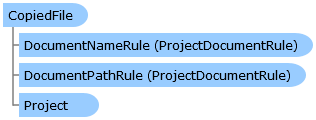

Collapse All Expand All Language Filter: All  Language Filter: Multiple  Language Filter: Visual Basic (Declaration) Language Filter: Visual Basic (Usage) Language Filter: C#  
---  
DriveWorks SDK Documentation  |   
---|---  
CopiedFile Class   
[Members](topic2607.md)   
[DriveWorks.Engine Assembly](topic2156.md) > [DriveWorks Namespace](topic2159.md) : CopiedFile Class  
---  
  
Visual Basic (Declaration)    
Visual Basic (Usage)    
C# 

Glossary Item Box

Provides support for creating duplicates of files as part of the DriveWorks specification. 

# Object Model

# Syntax

Visual Basic (Declaration)|   
---|---  
      
    
    Public Class CopiedFile 
       Inherits [FileDocumentBase](topic2870.md)
       Implements [DriveWorks.Extensibility.IExtension](topic7152.md)   
  
Visual Basic (Usage)| Copy Code  
---|---  
      
    
    Dim instance As [CopiedFile](topic2606.md)  
  
C#|   
---|---  
      
    
    public class CopiedFile : [FileDocumentBase](topic2870.md), [DriveWorks.Extensibility.IExtension](topic7152.md)    
  
# Inheritance Hierarchy

System.Object  
System.MarshalByRefObject  
[DriveWorks.ProjectDocument](topic4356.md)  
[DriveWorks.FileDocumentBase](topic2870.md)  
**DriveWorks.CopiedFile**  

# Requirements

**Target Platforms:** Please see DriveWorks software prerequisites.

# See Also

#### Reference

[CopiedFile Members](topic2607.md)   
[DriveWorks Namespace](topic2159.md)

