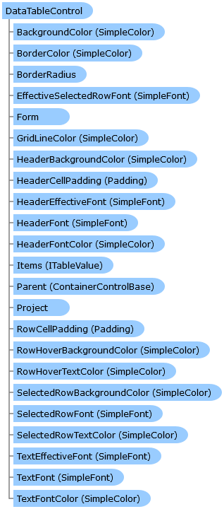

       

 Collapse All Expand All  Language Filter: All  Language Filter: Multiple  Language Filter: Visual Basic (Declaration) Language Filter: Visual Basic (Usage) Language Filter: C#  
---  
DriveWorks SDK Documentation  |   
---|---  
DataTableControl Class   
[Members](topic7865.md)   
[DriveWorks.Engine Assembly](topic2156.md) > [DriveWorks.Forms Namespace](topic7266.md) : DataTableControl Class  
---  
  
Visual Basic (Declaration)    
Visual Basic (Usage)    
C# 

Glossary Item Box

Implements a data table control. 

# Object Model

# Syntax

Visual Basic (Declaration)|   
---|---  
      
    
    <[RuleTechnologyAttribute](topic8848.md)(ProjectRuleTechnology.Titan)>
    <[DefaultSizeAttribute](topic8042.md)(Width=500, Height=200)>
    Public Class DataTableControl 
       Inherits [ControlBase](topic7698.md)
       Implements [DriveWorks.Extensibility.IExtension](topic7152.md), [IHasCopyableValue](topic7275.md)   
  
Visual Basic (Usage)| Copy Code  
---|---  
      
    
    Dim instance As [DataTableControl](topic7864.md)  
  
C#|   
---|---  
      
    
    [[RuleTechnologyAttribute](topic8848.md)(ProjectRuleTechnology.Titan)]
    [[DefaultSizeAttribute](topic8042.md)(Width=500, Height=200)]
    public class DataTableControl : [ControlBase](topic7698.md), [DriveWorks.Extensibility.IExtension](topic7152.md), [IHasCopyableValue](topic7275.md)    
  
# Remarks

This control is not supported for projects using Microsoft Excel as a rules-engine.

# Inheritance Hierarchy

System.Object  
System.MarshalByRefObject  
[DriveWorks.Forms.ControlBase](topic7698.md)  
**DriveWorks.Forms.DataTableControl**  

# Requirements

**Target Platforms:** Please see DriveWorks software prerequisites.

# See Also

#### Reference

[DataTableControl Members](topic7865.md)   
[DriveWorks.Forms Namespace](topic7266.md)

