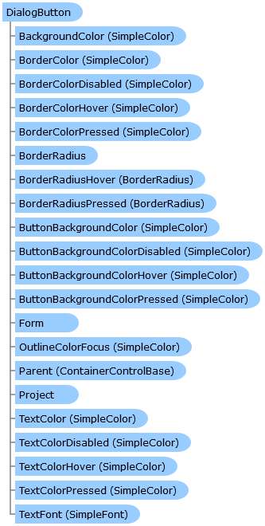

Collapse All Expand All Language Filter: All  Language Filter: Multiple  Language Filter: Visual Basic (Declaration) Language Filter: Visual Basic (Usage) Language Filter: C#  
---  
DriveWorks SDK Documentation  |   
---|---  
DialogButton Class   
[Members](topic8052.md)   
[DriveWorks.Engine Assembly](topic2156.md) > [DriveWorks.Forms Namespace](topic7266.md) : DialogButton Class  
---  
  
Visual Basic (Declaration)    
Visual Basic (Usage)    
C# 

Glossary Item Box

Implements a dialog button control. 

# Object Model

# Syntax

Visual Basic (Declaration)|   
---|---  
      
    
    <[DefaultSizeAttribute](topic8042.md)(Width=150, Height=30)>
    Public Class DialogButton 
       Inherits [ButtonBase](topic7338.md)
       Implements [DriveWorks.Extensibility.IExtension](topic7152.md), [DriveWorks.IHasMainProperty](topic2225.md)   
  
Visual Basic (Usage)| Copy Code  
---|---  
      
    
    Dim instance As [DialogButton](topic8051.md)  
  
C#|   
---|---  
      
    
    [[DefaultSizeAttribute](topic8042.md)(Width=150, Height=30)]
    public class DialogButton : [ButtonBase](topic7338.md), [DriveWorks.Extensibility.IExtension](topic7152.md), [DriveWorks.IHasMainProperty](topic2225.md)    
  
# Inheritance Hierarchy

System.Object  
System.MarshalByRefObject  
[DriveWorks.Forms.ControlBase](topic7698.md)  
[DriveWorks.Forms.ButtonBase](topic7338.md)  
**DriveWorks.Forms.DialogButton**  

# Requirements

**Target Platforms:** Please see DriveWorks software prerequisites.

# See Also

#### Reference

[DialogButton Members](topic8052.md)   
[DriveWorks.Forms Namespace](topic7266.md)

