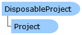

       

 Collapse All Expand All  Language Filter: All  Language Filter: Multiple  Language Filter: Visual Basic (Declaration) Language Filter: Visual Basic (Usage) Language Filter: C#  
---  
DriveWorks SDK Documentation  |   
---|---  
DisposableProject Class   
[Members](topic2729.md)   
[DriveWorks.Engine Assembly](topic2156.md) > [DriveWorks Namespace](topic2159.md) : DisposableProject Class  
---  
  
Visual Basic (Declaration)    
Visual Basic (Usage)    
C# 

Glossary Item Box

Represents a temporary project which can be used to query information about a project and later disposed. 

# Object Model

# Syntax

Visual Basic (Declaration)|   
---|---  
      
    
    Public NotInheritable Class DisposableProject   
  
Visual Basic (Usage)| Copy Code  
---|---  
      
    
    Dim instance As [DisposableProject](topic2728.md)  
  
C#|   
---|---  
      
    
    public sealed class DisposableProject   
  
# Inheritance Hierarchy

System.Object  
**DriveWorks.DisposableProject**  

# Requirements

**Target Platforms:** Please see DriveWorks software prerequisites.

# See Also

#### Reference

[DisposableProject Members](topic2729.md)   
[DriveWorks Namespace](topic2159.md)

