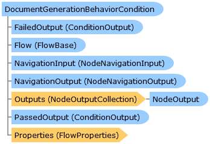

Collapse All Expand All Language Filter: All  Language Filter: Multiple  Language Filter: Visual Basic (Declaration) Language Filter: Visual Basic (Usage) Language Filter: C#  
---  
DriveWorks SDK Documentation  |   
---|---  
DocumentGenerationBehaviorCondition Class   
[Members](topic11852.md)   
[DriveWorks.Engine Assembly](topic2156.md) > [DriveWorks.Specification.StandardConditions Namespace](topic11828.md) : DocumentGenerationBehaviorCondition Class  
---  
  
Visual Basic (Declaration)    
Visual Basic (Usage)    
C# 

Glossary Item Box

A specification-flow condition which checks a specification setting. 

# Object Model

# Syntax

Visual Basic (Declaration)|   
---|---  
      
    
    <[ConditionAttribute](topic10832.md)(DisplayName="resx://DriveWorks.ConditionsLocalizedResources,ConditionDispNameDocumentGenerationBehaviorCondition", 
       Image="embedded://DriveWorks.DriveWorksSettingConditionPlain16.png", 
       WarningOutputEnabled=True)>
    Public Class DocumentGenerationBehaviorCondition 
       Inherits [DriveWorks.Specification.Condition](topic10804.md)
       Implements [DriveWorks.EventFlow.IFlowNode](topic6873.md), [DriveWorks.Extensibility.IExtension](topic7152.md)   
  
Visual Basic (Usage)| Copy Code  
---|---  
      
    
    Dim instance As [DocumentGenerationBehaviorCondition](topic11851.md)  
  
C#|   
---|---  
      
    
    [[ConditionAttribute](topic10832.md)(DisplayName="resx://DriveWorks.ConditionsLocalizedResources,ConditionDispNameDocumentGenerationBehaviorCondition", 
       Image="embedded://DriveWorks.DriveWorksSettingConditionPlain16.png", 
       WarningOutputEnabled=true)]
    public class DocumentGenerationBehaviorCondition : [DriveWorks.Specification.Condition](topic10804.md), [DriveWorks.EventFlow.IFlowNode](topic6873.md), [DriveWorks.Extensibility.IExtension](topic7152.md)    
  
# Inheritance Hierarchy

System.Object  
System.MarshalByRefObject  
[DriveWorks.EventFlow.ExecutableNodeBase](topic6938.md)  
[DriveWorks.Specification.Condition](topic10804.md)  
**DriveWorks.Specification.StandardConditions.DocumentGenerationBehaviorCondition**  

# Requirements

**Target Platforms:** Please see DriveWorks software prerequisites.

# See Also

#### Reference

[DocumentGenerationBehaviorCondition Members](topic11852.md)   
[DriveWorks.Specification.StandardConditions Namespace](topic11828.md)

