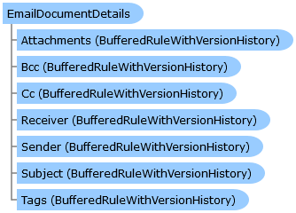

       

 Collapse All Expand All  Language Filter: All  Language Filter: Multiple  Language Filter: Visual Basic (Declaration) Language Filter: Visual Basic (Usage) Language Filter: C#  
---  
DriveWorks SDK Documentation  |   
---|---  
EmailDocumentDetails Class   
[Members](topic2794.md)   
[DriveWorks.Engine Assembly](topic2156.md) > [DriveWorks Namespace](topic2159.md) : EmailDocumentDetails Class  
---  
  
Visual Basic (Declaration)    
Visual Basic (Usage)    
C# 

Glossary Item Box

Provides a cached copy of an email documents settings that can be edited and then pushed into the document at will. 

# Object Model

# Syntax

Visual Basic (Declaration)|   
---|---  
      
    
    Public Class EmailDocumentDetails   
  
Visual Basic (Usage)| Copy Code  
---|---  
      
    
    Dim instance As [EmailDocumentDetails](topic2793.md)  
  
C#|   
---|---  
      
    
    public class EmailDocumentDetails   
  
# Inheritance Hierarchy

System.Object  
**DriveWorks.EmailDocumentDetails**  

# Requirements

**Target Platforms:** Please see DriveWorks software prerequisites.

# See Also

#### Reference

[EmailDocumentDetails Members](topic2794.md)   
[DriveWorks Namespace](topic2159.md)

