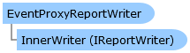

Collapse All Expand All Language Filter: All  Language Filter: Multiple  Language Filter: Visual Basic (Declaration) Language Filter: Visual Basic (Usage) Language Filter: C#  
---  
DriveWorks SDK Documentation  |   
---|---  
EventProxyReportWriter Class   
[Members](topic10393.md)   
[DriveWorks.Engine Assembly](topic2156.md) > [DriveWorks.Reporting Namespace](topic10334.md) : EventProxyReportWriter Class  
---  
  
Visual Basic (Declaration)    
Visual Basic (Usage)    
C# 

Glossary Item Box

Implements a report writer which proxies to another report writer and raises events when processes and entries are written. 

# Object Model

# Syntax

Visual Basic (Declaration)|   
---|---  
      
    
    Public Class EventProxyReportWriter 
       Inherits [ProxyReportWriter](topic10434.md)
       Implements [IEventReportWriter](topic10336.md), [IReportWriter](topic10344.md)   
  
Visual Basic (Usage)| Copy Code  
---|---  
      
    
    Dim instance As [EventProxyReportWriter](topic10392.md)  
  
C#|   
---|---  
      
    
    public class EventProxyReportWriter : [ProxyReportWriter](topic10434.md), [IEventReportWriter](topic10336.md), [IReportWriter](topic10344.md)    
  
# Inheritance Hierarchy

System.Object  
[DriveWorks.Reporting.ProxyReportWriter](topic10434.md)  
**DriveWorks.Reporting.EventProxyReportWriter**  

# Requirements

**Target Platforms:** Please see DriveWorks software prerequisites.

# See Also

#### Reference

[EventProxyReportWriter Members](topic10393.md)   
[DriveWorks.Reporting Namespace](topic10334.md)

