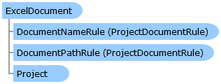

       

 Collapse All Expand All  Language Filter: All  Language Filter: Multiple  Language Filter: Visual Basic (Declaration) Language Filter: Visual Basic (Usage) Language Filter: C#  
---  
DriveWorks SDK Documentation  |   
---|---  
ExcelDocument Class   
[Members](topic2835.md)   
[DriveWorks.Engine Assembly](topic2156.md) > [DriveWorks Namespace](topic2159.md) : ExcelDocument Class  
---  
  
Visual Basic (Declaration)    
Visual Basic (Usage)    
C# 

Glossary Item Box

Provides support for creating Microsoft Excel documents as part of a DriveWorks specification. 

# Object Model

# Syntax

Visual Basic (Declaration)|   
---|---  
      
    
    Public Class ExcelDocument 
       Inherits [FileDocumentBase](topic2870.md)
       Implements [DriveWorks.Extensibility.IExtension](topic7152.md)   
  
Visual Basic (Usage)| Copy Code  
---|---  
      
    
    Dim instance As [ExcelDocument](topic2834.md)  
  
C#|   
---|---  
      
    
    public class ExcelDocument : [FileDocumentBase](topic2870.md), [DriveWorks.Extensibility.IExtension](topic7152.md)    
  
# Remarks

To create a new instance of an Excel document, use the [Project](topic4395.md).[Documents](topic4434.md).[CreateDocument](topic4442.md) method.

# Inheritance Hierarchy

System.Object  
System.MarshalByRefObject  
[DriveWorks.ProjectDocument](topic4356.md)  
[DriveWorks.FileDocumentBase](topic2870.md)  
**DriveWorks.ExcelDocument**  

# Requirements

**Target Platforms:** Please see DriveWorks software prerequisites.

# See Also

#### Reference

[ExcelDocument Members](topic2835.md)   
[DriveWorks Namespace](topic2159.md)

