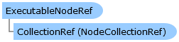

Collapse All Expand All Language Filter: All  Language Filter: Multiple  Language Filter: Visual Basic (Declaration) Language Filter: Visual Basic (Usage) Language Filter: C#  
---  
DriveWorks SDK Documentation  |   
---|---  
ExecutableNodeRef Class   
[Members](topic12865.md)   
[DriveWorks.Engine Assembly](topic2156.md) > [DriveWorks.Transactions Namespace](topic12835.md) : ExecutableNodeRef Class  
---  
  
Visual Basic (Declaration)    
Visual Basic (Usage)    
C# 

Glossary Item Box

Represents a reference to an executable node. 

# Object Model

# Syntax

Visual Basic (Declaration)|   
---|---  
      
    
    Public Class ExecutableNodeRef 
       Inherits [NodeRef](topic12909.md)  
  
Visual Basic (Usage)| Copy Code  
---|---  
      
    
    Dim instance As [ExecutableNodeRef](topic12864.md)  
  
C#|   
---|---  
      
    
    public class ExecutableNodeRef : [NodeRef](topic12909.md)   
  
# Inheritance Hierarchy

System.Object  
[DriveWorks.Transactions.NodeRef](topic12909.md)  
**DriveWorks.Transactions.ExecutableNodeRef**  

# Requirements

**Target Platforms:** Please see DriveWorks software prerequisites.

# See Also

#### Reference

[ExecutableNodeRef Members](topic12865.md)   
[DriveWorks.Transactions Namespace](topic12835.md)

