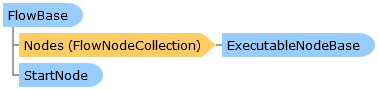

       

 Collapse All Expand All  Language Filter: All  Language Filter: Multiple  Language Filter: Visual Basic (Declaration) Language Filter: Visual Basic (Usage) Language Filter: C#  
---  
DriveWorks SDK Documentation  |   
---|---  
FlowBase Class   
[Members](topic7000.md) See Also [Send Feedback](mailto:apisupport@driveworks.co.uk?subject=Documentation Feedback: topic6999.md)  
[DriveWorks.Engine Assembly](topic2156.md) > [DriveWorks.EventFlow Namespace](topic6871.md) : FlowBase Class  
---  
  
Visual Basic (Declaration)    
Visual Basic (Usage)    
C# 

Glossary Item Box

Provides the base for all flows that allow nodes to be connected. 

# Object Model

# Syntax

Visual Basic (Declaration)|   
---|---  
      
    
    Public MustInherit Class FlowBase 
       Inherits DriveWorks.DomainObject  
  
Visual Basic (Usage)| Copy Code  
---|---  
      
    
    Dim instance As [FlowBase](topic6999.md)  
  
C#|   
---|---  
      
    
    public abstract class FlowBase : DriveWorks.DomainObject   
  
# Inheritance Hierarchy

System.Object  
System.MarshalByRefObject  
**DriveWorks.EventFlow.FlowBase**  
[DriveWorks.Specification.SpecificationMacro](topic11429.md)  

# Requirements

**Target Platforms:** Please see DriveWorks software prerequisites.

# See Also

#### Reference

[FlowBase Members](topic7000.md)   
[DriveWorks.EventFlow Namespace](topic6871.md)

©2024 DriveWorks Ltd. All Rights Reserved.
