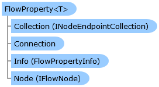

_T_
    The type of the property.

Collapse All Expand All Language Filter: All  Language Filter: Multiple  Language Filter: Visual Basic (Declaration) Language Filter: Visual Basic (Usage) Language Filter: C#  
---  
DriveWorks SDK Documentation  |   
---|---  
FlowProperty<T> Class   
[Members](topic10979.md)   
[DriveWorks.Engine Assembly](topic2156.md) > [DriveWorks.Specification Namespace](topic10764.md) : FlowProperty<T> Class  
---  
  
Visual Basic (Declaration)    
Visual Basic (Usage)    
C# 

Glossary Item Box

Represents a typed property on a condition or task. 

# Object Model

# Syntax

Visual Basic (Declaration)|   
---|---  
      
    
    Public MustInherit Class FlowProperty(Of T) 
       Inherits [FlowProperty](topic10946.md)
       Implements [DriveWorks.Abstractions.IHasRule](topic5947.md), [DriveWorks.Abstractions.IHasRuleId](topic5957.md), [DriveWorks.Abstractions.IHasRuleType](topic5969.md), [DriveWorks.Abstractions.IHasRuleVersionHistory](topic5975.md), Titan.Rules.Execution.IHasCustomName   
  
Visual Basic (Usage)| Copy Code  
---|---  
      
    
    Dim instance As [FlowProperty(Of T)](topic10978.md)  
  
C#|   
---|---  
      
    
    public abstract class FlowProperty<T> : [FlowProperty](topic10946.md), [DriveWorks.Abstractions.IHasRule](topic5947.md), [DriveWorks.Abstractions.IHasRuleId](topic5957.md), [DriveWorks.Abstractions.IHasRuleType](topic5969.md), [DriveWorks.Abstractions.IHasRuleVersionHistory](topic5975.md), Titan.Rules.Execution.IHasCustomName    
  
# Type Parameters

_T_
    The type of the property.

# Inheritance Hierarchy

System.Object  
System.MarshalByRefObject  
[DriveWorks.EventFlow.ConnectionEndpoint](topic6918.md)  
[DriveWorks.EventFlow.InputConnectionEndpoint](topic7033.md)  
[DriveWorks.Specification.FlowProperty](topic10946.md)  
**DriveWorks.Specification.FlowProperty <T>**  

# Requirements

**Target Platforms:** Please see DriveWorks software prerequisites.

# See Also

#### Reference

[FlowProperty<T> Members](topic10979.md)   
[DriveWorks.Specification Namespace](topic10764.md)

