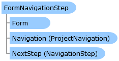

Collapse All Expand All Language Filter: All  Language Filter: Multiple  Language Filter: Visual Basic (Declaration) Language Filter: Visual Basic (Usage) Language Filter: C#  
---  
DriveWorks SDK Documentation  |   
---|---  
FormNavigationStep Class   
[Members](topic10154.md)   
[DriveWorks.Engine Assembly](topic2156.md) > [DriveWorks.Navigation Namespace](topic10114.md) : FormNavigationStep Class  
---  
  
Visual Basic (Declaration)    
Visual Basic (Usage)    
C# 

Glossary Item Box

Represents a form in a project's navigation. 

# Object Model

# Syntax

Visual Basic (Declaration)|   
---|---  
      
    
    Public NotInheritable Class FormNavigationStep 
       Inherits [NavigationStep](topic10175.md)  
  
Visual Basic (Usage)| Copy Code  
---|---  
      
    
    Dim instance As [FormNavigationStep](topic10153.md)  
  
C#|   
---|---  
      
    
    public sealed class FormNavigationStep : [NavigationStep](topic10175.md)   
  
# Inheritance Hierarchy

System.Object  
System.MarshalByRefObject  
[DriveWorks.Navigation.NavigationStep](topic10175.md)  
**DriveWorks.Navigation.FormNavigationStep**  

# Requirements

**Target Platforms:** Please see DriveWorks software prerequisites.

# See Also

#### Reference

[FormNavigationStep Members](topic10154.md)   
[DriveWorks.Navigation Namespace](topic10114.md)

