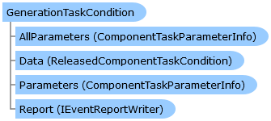

       

 Collapse All Expand All  Language Filter: All  Language Filter: Multiple  Language Filter: Visual Basic (Declaration) Language Filter: Visual Basic (Usage) Language Filter: C#  
---  
DriveWorks SDK Documentation  |   
---|---  
GenerationTaskCondition Class   
[Members](topic13708.md) Example   
[DriveWorks.SolidWorks Assembly](topic13342.md) > [DriveWorks.SolidWorks Namespace](topic13345.md) : GenerationTaskCondition Class  
---  
  
Visual Basic (Declaration)    
Visual Basic (Usage)    
C# 

Glossary Item Box

Represents a condition which governs whether a [GenerationTask](topic13678.md) will run during generation. 

# Object Model

# Syntax

Visual Basic (Declaration)|   
---|---  
      
    
    Public MustInherit Class GenerationTaskCondition 
       Implements [DriveWorks.Components.Tasks.IComponentTaskCondition](topic6399.md), [DriveWorks.Extensibility.IExtension](topic7152.md)   
  
Visual Basic (Usage)| Copy Code  
---|---  
      
    
    Dim instance As [GenerationTaskCondition](topic13707.md)  
  
C#|   
---|---  
      
    
    public abstract class GenerationTaskCondition : [DriveWorks.Components.Tasks.IComponentTaskCondition](topic6399.md), [DriveWorks.Extensibility.IExtension](topic7152.md)    
  
# Example

Visual Basic| Copy Code  
---|---  
      
    
    <GenerationTaskCondition("Has Custom Property", "Ensures the model has a name custom property", "embedded://MyExtension.Puzzle-16x16.png", "Model")>
    Public Class HasCustomPropertyCondition
        Inherits GenerationTaskCondition
    
        Public Overrides ReadOnly Property Parameters As ComponentTaskParameterInfo()
            Get
                Return New ComponentTaskParameterInfo() {
                        New ComponentTaskParameterInfo("CustomPropertyName", "Custom Property Name", "The name of the custom property to search for")
                    }
            End Get
        End Property
    
        Protected Overrides Function Evaluate(model As SldWorksModelProxy, component As ReleasedComponent, generationSettings As GenerationSettings) As Boolean
    
            Dim customPropertyName As String = Nothing
            If Not Me.Data.TryGetParameterValue("CustomPropertyName", True, customPropertyName) Then
                Return False ' Name was empty 
            End If
    
            Dim customPropertyNames = New HashSet(Of String)(DirectCast(If(model.Model.GetCustomInfoNames(), New String() {}), String()), StringComparer.OrdinalIgnoreCase)
    
            Return customPropertyNames.Contains(customPropertyName)
        End Function
    End Class  
  
# Inheritance Hierarchy

System.Object  
**DriveWorks.SolidWorks.GenerationTaskCondition**  
[DriveWorks.SolidWorks.CustomPropertyValueCondition](topic13527.md)  
[DriveWorks.SolidWorks.DimensionValueCondition](topic13536.md)  
[DriveWorks.SolidWorks.HasCustomPropertyCondition](topic13772.md)  
[DriveWorks.SolidWorks.MassPropertyCondition](topic13781.md)  

# Requirements

**Target Platforms:** Please see DriveWorks software prerequisites.

# See Also

#### Reference

[GenerationTaskCondition Members](topic13708.md)   
[DriveWorks.SolidWorks Namespace](topic13345.md)

