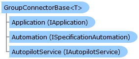

_T_
    

Collapse All Expand All Language Filter: All  Language Filter: Multiple  Language Filter: Visual Basic (Declaration) Language Filter: Visual Basic (Usage) Language Filter: C#  
---  
DriveWorks SDK Documentation  |   
---|---  
GroupConnectorBase<T> Class   
[Members](topic1858.md)   
[DriveWorks.Applications Assembly](topic13.md) > [DriveWorks.Applications.Autopilot.Extensibility Namespace](topic1633.md) : GroupConnectorBase<T> Class  
---  
  
Visual Basic (Declaration)    
Visual Basic (Usage)    
C# 

Glossary Item Box

Provides a base class to make implementing group connectors easier. 

# Object Model

# Syntax

Visual Basic (Declaration)|   
---|---  
      
    
    Public MustInherit Class GroupConnectorBase(Of T As [GroupConnectorInformation](topic3084.md)) 
       Implements [IGroupConnector](topic1706.md)   
  
Visual Basic (Usage)| Copy Code  
---|---  
      
    
    Dim instance As [GroupConnectorBase(Of T)](topic1857.md)  
  
C#|   
---|---  
      
    
    public abstract class GroupConnectorBase<T> : [IGroupConnector](topic1706.md)  
    where T: [GroupConnectorInformation](topic3084.md)  
  
# Type Parameters

_T_
    

# Inheritance Hierarchy

System.Object  
**DriveWorks.Applications.Autopilot.Extensibility.GroupConnectorBase <T>**  
[DriveWorks.Applications.Autopilot.Extensibility.GroupPollingConnectorBase<T>](topic1878.md)  

# Requirements

**Target Platforms:** Please see DriveWorks software prerequisites.

# See Also

#### Reference

[GroupConnectorBase<T> Members](topic1858.md)   
[DriveWorks.Applications.Autopilot.Extensibility Namespace](topic1633.md)

