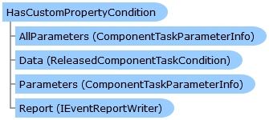

Collapse All Expand All Language Filter: All  Language Filter: Multiple  Language Filter: Visual Basic (Declaration) Language Filter: Visual Basic (Usage) Language Filter: C#  
---  
DriveWorks SDK Documentation  |   
---|---  
HasCustomPropertyCondition Class   
[Members](topic13773.md)   
[DriveWorks.SolidWorks Assembly](topic13342.md) > [DriveWorks.SolidWorks Namespace](topic13345.md) : HasCustomPropertyCondition Class  
---  
  
Visual Basic (Declaration)    
Visual Basic (Usage)    
C# 

Glossary Item Box

Represents a condition for a [GenerationTask](topic13678.md) that checks to see whether a Custom Property exists in the SOLIDWOKRS model. 

# Object Model

# Syntax

Visual Basic (Declaration)|   
---|---  
      
    
    <[GenerationTaskConditionAttribute](topic13721.md)(Scope=GenerationTaskScope.Assemblies Or  _
        GenerationTaskScope.Parts Or  _
        GenerationTaskScope.Drawings Or  _
        GenerationTaskScope.All, 
       Title="resx://DriveWorks.SolidWorks.TasksLocalizedResources,HasCPConditionName", 
       Description="resx://DriveWorks.SolidWorks.TasksLocalizedResources,HasCPConditionDescription", 
       Image="embedded://DriveWorks.SolidWorks.CustomPropertiesPlain16.png", 
       Category="resx://DriveWorks.SolidWorks.TasksLocalizedResources,TaskCategoryGeneral", 
       AllowedLocations=ComponentTaskSequenceLocation.Before Or  _
        ComponentTaskSequenceLocation.After Or  _
        ComponentTaskSequenceLocation.PreClose)>
    Public Class HasCustomPropertyCondition 
       Inherits [GenerationTaskCondition](topic13707.md)
       Implements [DriveWorks.Components.Tasks.IComponentTaskCondition](topic6399.md), [DriveWorks.Extensibility.IExtension](topic7152.md)   
  
Visual Basic (Usage)| Copy Code  
---|---  
      
    
    Dim instance As [HasCustomPropertyCondition](topic13772.md)  
  
C#|   
---|---  
      
    
    [[GenerationTaskConditionAttribute](topic13721.md)(Scope=GenerationTaskScope.Assemblies | 
        GenerationTaskScope.Parts | 
        GenerationTaskScope.Drawings | 
        GenerationTaskScope.All, 
       Title="resx://DriveWorks.SolidWorks.TasksLocalizedResources,HasCPConditionName", 
       Description="resx://DriveWorks.SolidWorks.TasksLocalizedResources,HasCPConditionDescription", 
       Image="embedded://DriveWorks.SolidWorks.CustomPropertiesPlain16.png", 
       Category="resx://DriveWorks.SolidWorks.TasksLocalizedResources,TaskCategoryGeneral", 
       AllowedLocations=ComponentTaskSequenceLocation.Before | 
        ComponentTaskSequenceLocation.After | 
        ComponentTaskSequenceLocation.PreClose)]
    public class HasCustomPropertyCondition : [GenerationTaskCondition](topic13707.md), [DriveWorks.Components.Tasks.IComponentTaskCondition](topic6399.md), [DriveWorks.Extensibility.IExtension](topic7152.md)    
  
# Inheritance Hierarchy

System.Object  
[DriveWorks.SolidWorks.GenerationTaskCondition](topic13707.md)  
**DriveWorks.SolidWorks.HasCustomPropertyCondition**  

# Requirements

**Target Platforms:** Please see DriveWorks software prerequisites.

# See Also

#### Reference

[HasCustomPropertyCondition Members](topic13773.md)   
[DriveWorks.SolidWorks Namespace](topic13345.md)

