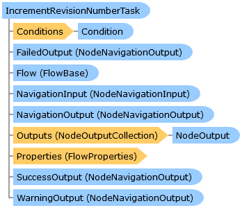

Collapse All Expand All Language Filter: All  Language Filter: Multiple  Language Filter: Visual Basic (Declaration) Language Filter: Visual Basic (Usage) Language Filter: C#  
---  
DriveWorks SDK Documentation  |   
---|---  
IncrementRevisionNumberTask Class   
[Members](topic12308.md)   
[DriveWorks.Engine Assembly](topic2156.md) > [DriveWorks.Specification.StandardTasks Namespace](topic11896.md) : IncrementRevisionNumberTask Class  
---  
  
Visual Basic (Declaration)    
Visual Basic (Usage)    
C# 

Glossary Item Box

A specification-flow task which increments the specification's revision number. 

# Object Model

# Syntax

Visual Basic (Declaration)|   
---|---  
      
    
    <[TaskAttribute](topic11659.md)(DisplayName="resx://DriveWorks.TasksLocalizedResources,TaskDispNameIncrementRevisionNumber", 
       Image="embedded://DriveWorks.IncrementRevisionNumberPlain16.png", 
       CategoryName="resx://DriveWorks.TasksLocalizedResources,TaskCategorySpecifications", 
       WarningOutputEnabled=False)>
    Public NotInheritable Class IncrementRevisionNumberTask 
       Inherits [DriveWorks.Specification.Task](topic11629.md)
       Implements [DriveWorks.EventFlow.IFlowNode](topic6873.md), [DriveWorks.Extensibility.IExtension](topic7152.md)   
  
Visual Basic (Usage)| Copy Code  
---|---  
      
    
    Dim instance As [IncrementRevisionNumberTask](topic12307.md)  
  
C#|   
---|---  
      
    
    [[TaskAttribute](topic11659.md)(DisplayName="resx://DriveWorks.TasksLocalizedResources,TaskDispNameIncrementRevisionNumber", 
       Image="embedded://DriveWorks.IncrementRevisionNumberPlain16.png", 
       CategoryName="resx://DriveWorks.TasksLocalizedResources,TaskCategorySpecifications", 
       WarningOutputEnabled=false)]
    public sealed class IncrementRevisionNumberTask : [DriveWorks.Specification.Task](topic11629.md), [DriveWorks.EventFlow.IFlowNode](topic6873.md), [DriveWorks.Extensibility.IExtension](topic7152.md)    
  
# Inheritance Hierarchy

System.Object  
System.MarshalByRefObject  
[DriveWorks.EventFlow.ExecutableNodeBase](topic6938.md)  
[DriveWorks.EventFlow.ExecutableNodeWithStatus](topic6990.md)  
[DriveWorks.Specification.Task](topic11629.md)  
**DriveWorks.Specification.StandardTasks.IncrementRevisionNumberTask**  

# Requirements

**Target Platforms:** Please see DriveWorks software prerequisites.

# See Also

#### Reference

[IncrementRevisionNumberTask Members](topic12308.md)   
[DriveWorks.Specification.StandardTasks Namespace](topic11896.md)

