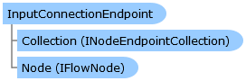

       

 Collapse All Expand All  Language Filter: All  Language Filter: Multiple  Language Filter: Visual Basic (Declaration) Language Filter: Visual Basic (Usage) Language Filter: C#  
---  
DriveWorks SDK Documentation  |   
---|---  
InputConnectionEndpoint Class   
[Members](topic7034.md)   
[DriveWorks.Engine Assembly](topic2156.md) > [DriveWorks.EventFlow Namespace](topic6871.md) : InputConnectionEndpoint Class  
---  
  
Visual Basic (Declaration)    
Visual Basic (Usage)    
C# 

Glossary Item Box

Represents the common base class for all input connection endpoints on nodes. 

# Object Model

# Syntax

Visual Basic (Declaration)|   
---|---  
      
    
    Public MustInherit Class InputConnectionEndpoint 
       Inherits [ConnectionEndpoint](topic6918.md)  
  
Visual Basic (Usage)| Copy Code  
---|---  
      
    
    Dim instance As [InputConnectionEndpoint](topic7033.md)  
  
C#|   
---|---  
      
    
    public abstract class InputConnectionEndpoint : [ConnectionEndpoint](topic6918.md)   
  
# Inheritance Hierarchy

System.Object  
System.MarshalByRefObject  
[DriveWorks.EventFlow.ConnectionEndpoint](topic6918.md)  
**DriveWorks.EventFlow.InputConnectionEndpoint**  
[DriveWorks.EventFlow.NodeNavigationInput](topic7058.md)  
[DriveWorks.Specification.FlowProperty](topic10946.md)  

# Requirements

**Target Platforms:** Please see DriveWorks software prerequisites.

# See Also

#### Reference

[InputConnectionEndpoint Members](topic7034.md)   
[DriveWorks.EventFlow Namespace](topic6871.md)

