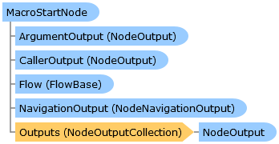

       

 Collapse All Expand All  Language Filter: All  Language Filter: Multiple  Language Filter: Visual Basic (Declaration) Language Filter: Visual Basic (Usage) Language Filter: C#  
---  
DriveWorks SDK Documentation  |   
---|---  
MacroStartNode Class   
[Members](topic7051.md) See Also [Send Feedback](mailto:apisupport@driveworks.co.uk?subject=Documentation Feedback: topic7050.md)  
[DriveWorks.Engine Assembly](topic2156.md) > [DriveWorks.EventFlow Namespace](topic6871.md) : MacroStartNode Class  
---  
  
Visual Basic (Declaration)    
Visual Basic (Usage)    
C# 

Glossary Item Box

Represents the very first task to execute in a [DriveWorks.Specification.SpecificationMacro](topic11429.md). 

# Object Model

# Syntax

Visual Basic (Declaration)|   
---|---  
      
    
    <[TaskAttribute](topic11659.md)(DisplayName="resx://DriveWorks.EventFlowResources,MacroStartNodeName", 
       Image="", 
       CategoryName="", 
       WarningOutputEnabled=True)>
    Public NotInheritable Class MacroStartNode 
       Inherits [StartNode](topic7120.md)
       Implements [IFlowNode](topic6873.md)   
  
Visual Basic (Usage)| Copy Code  
---|---  
      
    
    Dim instance As [MacroStartNode](topic7050.md)  
  
C#|   
---|---  
      
    
    [[TaskAttribute](topic11659.md)(DisplayName="resx://DriveWorks.EventFlowResources,MacroStartNodeName", 
       Image="", 
       CategoryName="", 
       WarningOutputEnabled=true)]
    public sealed class MacroStartNode : [StartNode](topic7120.md), [IFlowNode](topic6873.md)    
  
# Inheritance Hierarchy

System.Object  
[DriveWorks.EventFlow.StartNode](topic7120.md)  
**DriveWorks.EventFlow.MacroStartNode**  

# Requirements

**Target Platforms:** Please see DriveWorks software prerequisites.

# See Also

#### Reference

[MacroStartNode Members](topic7051.md)   
[DriveWorks.EventFlow Namespace](topic6871.md)

©2024 DriveWorks Ltd. All Rights Reserved.
