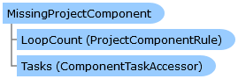

Collapse All Expand All Language Filter: All  Language Filter: Multiple  Language Filter: Visual Basic (Declaration) Language Filter: Visual Basic (Usage) Language Filter: C#  
---  
DriveWorks SDK Documentation  |   
---|---  
MissingProjectComponent Class   
[Members](topic6176.md)   
[DriveWorks.Engine Assembly](topic2156.md) > [DriveWorks.Components Namespace](topic6089.md) : MissingProjectComponent Class  
---  
  
Visual Basic (Declaration)    
Visual Basic (Usage)    
C# 

Glossary Item Box

Provides a project component implementation for project components whose underlying capture data can't be resolved. 

# Object Model

# Syntax

Visual Basic (Declaration)|   
---|---  
      
    
    Public NotInheritable Class MissingProjectComponent 
       Inherits [ProjectComponent](topic6183.md)  
  
Visual Basic (Usage)| Copy Code  
---|---  
      
    
    Dim instance As [MissingProjectComponent](topic6175.md)  
  
C#|   
---|---  
      
    
    public sealed class MissingProjectComponent : [ProjectComponent](topic6183.md)   
  
# Inheritance Hierarchy

System.Object  
System.MarshalByRefObject  
[DriveWorks.Components.ProjectComponent](topic6183.md)  
**DriveWorks.Components.MissingProjectComponent**  

# Requirements

**Target Platforms:** Please see DriveWorks software prerequisites.

# See Also

#### Reference

[MissingProjectComponent Members](topic6176.md)   
[DriveWorks.Components Namespace](topic6089.md)

