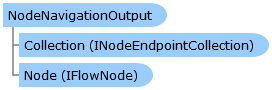

Collapse All Expand All Language Filter: All  Language Filter: Multiple  Language Filter: Visual Basic (Declaration) Language Filter: Visual Basic (Usage) Language Filter: C#  
---  
DriveWorks SDK Documentation  |   
---|---  
NodeNavigationOutput Class   
[Members](topic7068.md)   
[DriveWorks.Engine Assembly](topic2156.md) > [DriveWorks.EventFlow Namespace](topic6871.md) : NodeNavigationOutput Class  
---  
  
Visual Basic (Declaration)    
Visual Basic (Usage)    
C# 

Glossary Item Box

Represents a logical endpoint on a [IFlowNode](topic6873.md) that allows logical connections to be made between the node this output belongs to and the node a [NodeNavigationInput](topic7058.md) belongs to. 

# Object Model

# Syntax

Visual Basic (Declaration)|   
---|---  
      
    
    Public Class NodeNavigationOutput 
       Inherits [NodeOutput](topic7074.md)  
  
Visual Basic (Usage)| Copy Code  
---|---  
      
    
    Dim instance As [NodeNavigationOutput](topic7067.md)  
  
C#|   
---|---  
      
    
    public class NodeNavigationOutput : [NodeOutput](topic7074.md)   
  
# Inheritance Hierarchy

System.Object  
System.MarshalByRefObject  
[DriveWorks.EventFlow.ConnectionEndpoint](topic6918.md)  
[DriveWorks.EventFlow.NodeOutput](topic7074.md)  
**DriveWorks.EventFlow.NodeNavigationOutput**  

# Requirements

**Target Platforms:** Please see DriveWorks software prerequisites.

# See Also

#### Reference

[NodeNavigationOutput Members](topic7068.md)   
[DriveWorks.EventFlow Namespace](topic6871.md)

