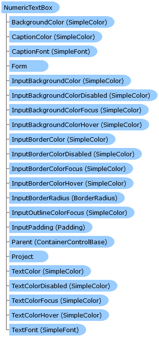

Collapse All Expand All Language Filter: All  Language Filter: Multiple  Language Filter: Visual Basic (Declaration) Language Filter: Visual Basic (Usage) Language Filter: C#  
---  
DriveWorks SDK Documentation  |   
---|---  
NumericTextBox Class   
[Members](topic8475.md)   
[DriveWorks.Engine Assembly](topic2156.md) > [DriveWorks.Forms Namespace](topic7266.md) : NumericTextBox Class  
---  
  
Visual Basic (Declaration)    
Visual Basic (Usage)    
C# 

Glossary Item Box

Provides an implementation of a numeric text box control. 

# Object Model

# Syntax

Visual Basic (Declaration)|   
---|---  
      
    
    <[DefaultSizeAttribute](topic8042.md)(Width=200, Height=20)>
    Public Class NumericTextBox 
       Inherits [CaptionControlBase](topic7390.md)
       Implements [DriveWorks.Extensibility.IExtension](topic7152.md), [IHasCopyableValue](topic7275.md), [DriveWorks.IHasMainProperty](topic2225.md)   
  
Visual Basic (Usage)| Copy Code  
---|---  
      
    
    Dim instance As [NumericTextBox](topic8474.md)  
  
C#|   
---|---  
      
    
    [[DefaultSizeAttribute](topic8042.md)(Width=200, Height=20)]
    public class NumericTextBox : [CaptionControlBase](topic7390.md), [DriveWorks.Extensibility.IExtension](topic7152.md), [IHasCopyableValue](topic7275.md), [DriveWorks.IHasMainProperty](topic2225.md)    
  
# Inheritance Hierarchy

System.Object  
System.MarshalByRefObject  
[DriveWorks.Forms.ControlBase](topic7698.md)  
[DriveWorks.Forms.CaptionControlBase](topic7390.md)  
**DriveWorks.Forms.NumericTextBox**  

# Requirements

**Target Platforms:** Please see DriveWorks software prerequisites.

# See Also

#### Reference

[NumericTextBox Members](topic8475.md)   
[DriveWorks.Forms Namespace](topic7266.md)

