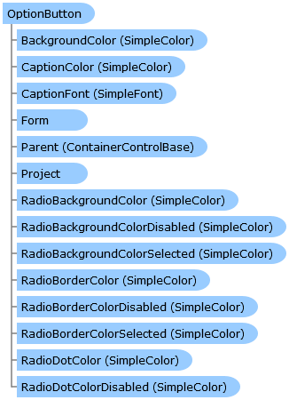

Collapse All Expand All Language Filter: All  Language Filter: Multiple  Language Filter: Visual Basic (Declaration) Language Filter: Visual Basic (Usage) Language Filter: C#  
---  
DriveWorks SDK Documentation  |   
---|---  
OptionButton Class   
[Members](topic8550.md)   
[DriveWorks.Engine Assembly](topic2156.md) > [DriveWorks.Forms Namespace](topic7266.md) : OptionButton Class  
---  
  
Visual Basic (Declaration)    
Visual Basic (Usage)    
C# 

Glossary Item Box

# Object Model

# Syntax

Visual Basic (Declaration)|   
---|---  
      
    
    <DebuggerDisplayAttribute(Value="Name={Name} - SelectedOption={SelectedOption}", 
       Name="", 
       Type="", 
       Target=, 
       TargetTypeName="")>
    <[DefaultSizeAttribute](topic8042.md)(Width=150, Height=20)>
    Public Class OptionButton 
       Inherits [CaptionControlBase](topic7390.md)
       Implements [DriveWorks.Extensibility.IExtension](topic7152.md), [DriveWorks.IHasMainProperty](topic2225.md)   
  
Visual Basic (Usage)| Copy Code  
---|---  
      
    
    Dim instance As [OptionButton](topic8549.md)  
  
C#|   
---|---  
      
    
    [DebuggerDisplayAttribute(Value="Name={Name} - SelectedOption={SelectedOption}", 
       Name="", 
       Type="", 
       Target=, 
       TargetTypeName="")]
    [[DefaultSizeAttribute](topic8042.md)(Width=150, Height=20)]
    public class OptionButton : [CaptionControlBase](topic7390.md), [DriveWorks.Extensibility.IExtension](topic7152.md), [DriveWorks.IHasMainProperty](topic2225.md)    
  
# Inheritance Hierarchy

System.Object  
System.MarshalByRefObject  
[DriveWorks.Forms.ControlBase](topic7698.md)  
[DriveWorks.Forms.CaptionControlBase](topic7390.md)  
**DriveWorks.Forms.OptionButton**  

# Requirements

**Target Platforms:** Please see DriveWorks software prerequisites.

# See Also

#### Reference

[OptionButton Members](topic8550.md)   
[DriveWorks.Forms Namespace](topic7266.md)

