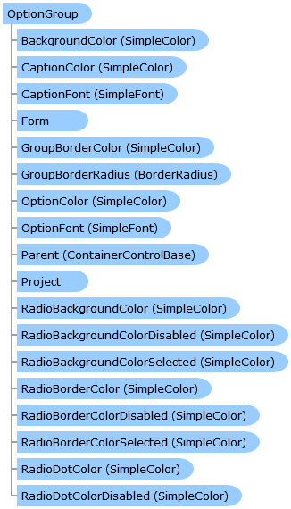

       

 Collapse All Expand All  Language Filter: All  Language Filter: Multiple  Language Filter: Visual Basic (Declaration) Language Filter: Visual Basic (Usage) Language Filter: C#  
---  
DriveWorks SDK Documentation  |   
---|---  
OptionGroup Class   
[Members](topic8609.md) See Also [Send Feedback](mailto:apisupport@driveworks.co.uk?subject=Documentation Feedback: topic8608.md)  
[DriveWorks.Engine Assembly](topic2156.md) > [DriveWorks.Forms Namespace](topic7266.md) : OptionGroup Class  
---  
  
Visual Basic (Declaration)    
Visual Basic (Usage)    
C# 

Glossary Item Box

Implements an option group control. 

# Object Model

# Syntax

Visual Basic (Declaration)|   
---|---  
      
    
    <[DefaultSizeAttribute](topic8042.md)(Width=200, Height=150)>
    Public Class OptionGroup 
       Inherits [ListControlBase](topic8315.md)
       Implements [DriveWorks.Extensibility.IExtension](topic7152.md), [IHasCopyableValue](topic7275.md), [DriveWorks.IHasMainProperty](topic2225.md)   
  
Visual Basic (Usage)| Copy Code  
---|---  
      
    
    Dim instance As [OptionGroup](topic8608.md)  
  
C#|   
---|---  
      
    
    [[DefaultSizeAttribute](topic8042.md)(Width=200, Height=150)]
    public class OptionGroup : [ListControlBase](topic8315.md), [DriveWorks.Extensibility.IExtension](topic7152.md), [IHasCopyableValue](topic7275.md), [DriveWorks.IHasMainProperty](topic2225.md)    
  
# Inheritance Hierarchy

System.Object  
System.MarshalByRefObject  
[DriveWorks.Forms.ControlBase](topic7698.md)  
[DriveWorks.Forms.CaptionControlBase](topic7390.md)  
[DriveWorks.Forms.ListControlBase](topic8315.md)  
**DriveWorks.Forms.OptionGroup**  

# Requirements

**Target Platforms:** Please see DriveWorks software prerequisites.

# See Also

#### Reference

[OptionGroup Members](topic8609.md)   
[DriveWorks.Forms Namespace](topic7266.md)

©2024 DriveWorks Ltd. All Rights Reserved.
