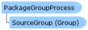

       

 Collapse All Expand All  Language Filter: All  Language Filter: Multiple  Language Filter: Visual Basic (Declaration) Language Filter: Visual Basic (Usage) Language Filter: C#  
---  
DriveWorks SDK Documentation  |   
---|---  
PackageGroupProcess Class   
[Members](topic9926.md)   
[DriveWorks.Engine Assembly](topic2156.md) > [DriveWorks.GroupMaintenance Namespace](topic9628.md) : PackageGroupProcess Class  
---  
  
Visual Basic (Declaration)    
Visual Basic (Usage)    
C# 

Glossary Item Box

Contains the implemented code for packaging a group. 

# Object Model

# Syntax

Visual Basic (Declaration)|   
---|---  
      
    
    Public Class PackageGroupProcess 
       Inherits [CopyGroupProcess](topic9776.md)  
  
Visual Basic (Usage)| Copy Code  
---|---  
      
    
    Dim instance As [PackageGroupProcess](topic9925.md)  
  
C#|   
---|---  
      
    
    public class PackageGroupProcess : [CopyGroupProcess](topic9776.md)   
  
# Inheritance Hierarchy

System.Object  
[DriveWorks.GroupMaintenance.CopyGroupProcess](topic9776.md)  
**DriveWorks.GroupMaintenance.PackageGroupProcess**  

# Requirements

**Target Platforms:** Please see DriveWorks software prerequisites.

# See Also

#### Reference

[PackageGroupProcess Members](topic9926.md)   
[DriveWorks.GroupMaintenance Namespace](topic9628.md)

