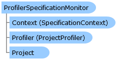

       

 Collapse All Expand All  Language Filter: All  Language Filter: Multiple  Language Filter: Visual Basic (Declaration) Language Filter: Visual Basic (Usage) Language Filter: C#  
---  
DriveWorks SDK Documentation  |   
---|---  
ProfilerSpecificationMonitor Class   
[Members](topic3839.md)   
[DriveWorks.Engine Assembly](topic2156.md) > [DriveWorks Namespace](topic2159.md) : ProfilerSpecificationMonitor Class  
---  
  
Visual Basic (Declaration)    
Visual Basic (Usage)    
C# 

Glossary Item Box

Provides support for monitoring a specification in the profiler. 

# Object Model

# Syntax

Visual Basic (Declaration)|   
---|---  
      
    
    Public Class ProfilerSpecificationMonitor   
  
Visual Basic (Usage)| Copy Code  
---|---  
      
    
    Dim instance As [ProfilerSpecificationMonitor](topic3838.md)  
  
C#|   
---|---  
      
    
    public class ProfilerSpecificationMonitor   
  
# Remarks

This also monitors for any child or hosted specifications within this specification.

# Inheritance Hierarchy

System.Object  
**DriveWorks.ProfilerSpecificationMonitor**  

# Requirements

**Target Platforms:** Please see DriveWorks software prerequisites.

# See Also

#### Reference

[ProfilerSpecificationMonitor Members](topic3839.md)   
[DriveWorks Namespace](topic2159.md)

