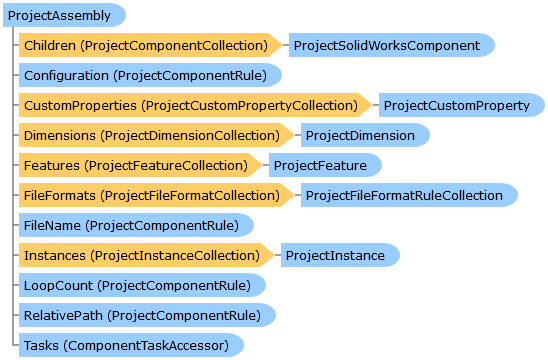

       

 Collapse All Expand All  Language Filter: All  Language Filter: Multiple  Language Filter: Visual Basic (Declaration) Language Filter: Visual Basic (Usage) Language Filter: C#  
---  
DriveWorks SDK Documentation  |   
---|---  
ProjectAssembly Class   
[Members](topic14430.md) See Also [Send Feedback](mailto:apisupport@driveworks.co.uk?subject=Documentation Feedback: topic14429.md)  
[DriveWorks.SolidWorks Assembly](topic13342.md) > [DriveWorks.SolidWorks.Components Namespace](topic13925.md) : ProjectAssembly Class  
---  
  
Visual Basic (Declaration)    
Visual Basic (Usage)    
C# 

Glossary Item Box

Represents a captured assembly which has been added to a project. 

# Object Model

# Syntax

Visual Basic (Declaration)|   
---|---  
      
    
    Public Class ProjectAssembly 
       Inherits [ProjectSolidWorksComponent](topic14692.md)
       Implements [IHasProjectComponents](topic13963.md), [IHasProjectConfiguration](topic13969.md), [IHasProjectCustomProperties](topic13975.md), [IHasProjectDimensions](topic13981.md), [IHasProjectFeatures](topic13987.md), [IHasProjectFileFormats](topic13993.md), [IHasProjectInstances](topic13999.md)   
  
Visual Basic (Usage)| Copy Code  
---|---  
      
    
    Dim instance As [ProjectAssembly](topic14429.md)  
  
C#|   
---|---  
      
    
    public class ProjectAssembly : [ProjectSolidWorksComponent](topic14692.md), [IHasProjectComponents](topic13963.md), [IHasProjectConfiguration](topic13969.md), [IHasProjectCustomProperties](topic13975.md), [IHasProjectDimensions](topic13981.md), [IHasProjectFeatures](topic13987.md), [IHasProjectFileFormats](topic13993.md), [IHasProjectInstances](topic13999.md)    
  
# Inheritance Hierarchy

System.Object  
System.MarshalByRefObject  
[DriveWorks.Components.ProjectComponent](topic6183.md)  
[DriveWorks.SolidWorks.Components.ProjectSolidWorksComponent](topic14692.md)  
**DriveWorks.SolidWorks.Components.ProjectAssembly**  

# Requirements

**Target Platforms:** Please see DriveWorks software prerequisites.

# See Also

#### Reference

[ProjectAssembly Members](topic14430.md)   
[DriveWorks.SolidWorks.Components Namespace](topic13925.md)

©2024 DriveWorks Ltd. All Rights Reserved.
