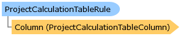

Collapse All Expand All Language Filter: All  Language Filter: Multiple  Language Filter: Visual Basic (Declaration) Language Filter: Visual Basic (Usage) Language Filter: C#  
---  
DriveWorks SDK Documentation  |   
---|---  
ProjectCalculationTableRule Class   
[Members](topic3987.md)   
[DriveWorks.Engine Assembly](topic2156.md) > [DriveWorks Namespace](topic2159.md) : ProjectCalculationTableRule Class  
---  
  
Visual Basic (Declaration)    
Visual Basic (Usage)    
C# 

Glossary Item Box

Provides a representation of a calculation table rule. I.e. either a cell rule or a column rule etc. 

# Object Model

# Syntax

Visual Basic (Declaration)|   
---|---  
      
    
    Public Class ProjectCalculationTableRule 
       Inherits DomainObject
       Implements [DriveWorks.Abstractions.IHasRule](topic5947.md), [DriveWorks.Abstractions.IHasRuleId](topic5957.md), [DriveWorks.Abstractions.IHasRuleName](topic5963.md), [DriveWorks.Abstractions.IHasRuleVersionHistory](topic5975.md), [IHasRuleContext](topic2237.md)   
  
Visual Basic (Usage)| Copy Code  
---|---  
      
    
    Dim instance As [ProjectCalculationTableRule](topic3986.md)  
  
C#|   
---|---  
      
    
    public class ProjectCalculationTableRule : DomainObject, [DriveWorks.Abstractions.IHasRule](topic5947.md), [DriveWorks.Abstractions.IHasRuleId](topic5957.md), [DriveWorks.Abstractions.IHasRuleName](topic5963.md), [DriveWorks.Abstractions.IHasRuleVersionHistory](topic5975.md), [IHasRuleContext](topic2237.md)    
  
# Inheritance Hierarchy

System.Object  
System.MarshalByRefObject  
**DriveWorks.ProjectCalculationTableRule**  

# Requirements

**Target Platforms:** Please see DriveWorks software prerequisites.

# See Also

#### Reference

[ProjectCalculationTableRule Members](topic3987.md)   
[DriveWorks Namespace](topic2159.md)

