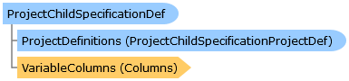

Collapse All Expand All Language Filter: All  Language Filter: Multiple  Language Filter: Visual Basic (Declaration) Language Filter: Visual Basic (Usage) Language Filter: C#  
---  
DriveWorks SDK Documentation  |   
---|---  
ProjectChildSpecificationDef Class   
[Members](topic4020.md)   
[DriveWorks.Engine Assembly](topic2156.md) > [DriveWorks Namespace](topic2159.md) : ProjectChildSpecificationDef Class  
---  
  
Visual Basic (Declaration)    
Visual Basic (Usage)    
C# 

Glossary Item Box

Provides access to a child specification definition. 

# Object Model

# Syntax

Visual Basic (Declaration)|   
---|---  
      
    
    Public NotInheritable Class ProjectChildSpecificationDef 
       Inherits DomainObject  
  
Visual Basic (Usage)| Copy Code  
---|---  
      
    
    Dim instance As [ProjectChildSpecificationDef](topic4019.md)  
  
C#|   
---|---  
      
    
    public sealed class ProjectChildSpecificationDef : DomainObject   
  
# Inheritance Hierarchy

System.Object  
System.MarshalByRefObject  
**DriveWorks.ProjectChildSpecificationDef**  

# Requirements

**Target Platforms:** Please see DriveWorks software prerequisites.

# See Also

#### Reference

[ProjectChildSpecificationDef Members](topic4020.md)   
[DriveWorks Namespace](topic2159.md)

