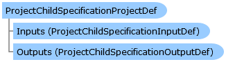

       

 Collapse All Expand All  Language Filter: All  Language Filter: Multiple  Language Filter: Visual Basic (Declaration) Language Filter: Visual Basic (Usage) Language Filter: C#  
---  
DriveWorks SDK Documentation  |   
---|---  
ProjectChildSpecificationProjectDef Class   
[Members](topic4068.md) See Also [Send Feedback](mailto:apisupport@driveworks.co.uk?subject=Documentation Feedback: topic4067.md)  
[DriveWorks.Engine Assembly](topic2156.md) > [DriveWorks Namespace](topic2159.md) : ProjectChildSpecificationProjectDef Class  
---  
  
Visual Basic (Declaration)    
Visual Basic (Usage)    
C# 

Glossary Item Box

Provides access to the input and output mappings that have been defined for a given type of project in a child specification definition. 

# Object Model

# Syntax

Visual Basic (Declaration)|   
---|---  
      
    
    Public NotInheritable Class ProjectChildSpecificationProjectDef 
       Inherits DomainObject  
  
Visual Basic (Usage)| Copy Code  
---|---  
      
    
    Dim instance As [ProjectChildSpecificationProjectDef](topic4067.md)  
  
C#|   
---|---  
      
    
    public sealed class ProjectChildSpecificationProjectDef : DomainObject   
  
# Inheritance Hierarchy

System.Object  
System.MarshalByRefObject  
**DriveWorks.ProjectChildSpecificationProjectDef**  

# Requirements

**Target Platforms:** Please see DriveWorks software prerequisites.

# See Also

#### Reference

[ProjectChildSpecificationProjectDef Members](topic4068.md)   
[DriveWorks Namespace](topic2159.md)

©2024 DriveWorks Ltd. All Rights Reserved.
