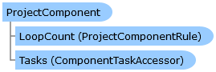

       

 Collapse All Expand All  Language Filter: All  Language Filter: Multiple  Language Filter: Visual Basic (Declaration) Language Filter: Visual Basic (Usage) Language Filter: C#  
---  
DriveWorks SDK Documentation  |   
---|---  
ProjectComponent Class   
[Members](topic6184.md)   
[DriveWorks.Engine Assembly](topic2156.md) > [DriveWorks.Components Namespace](topic6089.md) : ProjectComponent Class  
---  
  
Visual Basic (Declaration)    
Visual Basic (Usage)    
C# 

Glossary Item Box

Provides the base class for project components, which should be implemented by a component provider. 

# Object Model

# Syntax

Visual Basic (Declaration)|   
---|---  
      
    
    Public MustInherit Class ProjectComponent 
       Inherits DriveWorks.DomainObject  
  
Visual Basic (Usage)| Copy Code  
---|---  
      
    
    Dim instance As [ProjectComponent](topic6183.md)  
  
C#|   
---|---  
      
    
    public abstract class ProjectComponent : DriveWorks.DomainObject   
  
# Remarks

The DriveWorks Engine is independant of the SolidWorks implementation and providers can implement additional capturing and generation capabilities.

When retrieving a component from DriveWorks, you will need to cast from the `ProjectComponent` base type to the specific type of component you are dealing with, for example: `' Import the component namespace from DriveWorks.Engine.dll Imports DriveWorks.Components ' Import the SolidWorks specific namespace from DriveWorks.SolidWorks.dll Imports DriveWorks.SolidWorks.Components ... Public Sub LoadComponent(ByVal project As Project, ByVal componentId As Guid) Dim myComponent As ProjectComponent = project.Components(componentId) If TypeOf myComponent Is DriveWorks.SolidWorks.ProjectAssembly Then DoSomethingWithAssembly(DirectCast(myComponent, DriveWorks.SolidWorks.Components.ProjectAssembly)) ElseIf TypeOf myComponent Is DriveWorks.SolidWorks.ProjectPart Then DoSomethingWithPart(DirectCast(myComponent, DriveWorks.SolidWorks.Components.ProjectPart)) ElseIf TypeOf myComponent Is DriveWorks.SolidWorks.ProjectDrawing Then DoSomethingWithDrawing(DirectCast(myComponent, DriveWorks.SolidWorks.Components.ProjectDrawing)) Else MessageBox.Show("Not a SolidWorks component.") End If End Sub`

# Inheritance Hierarchy

System.Object  
System.MarshalByRefObject  
**DriveWorks.Components.ProjectComponent**  
[DriveWorks.Components.MissingProjectComponent](topic6175.md)  
[DriveWorks.SolidWorks.Components.ProjectSolidWorksComponent](topic14692.md)  

# Requirements

**Target Platforms:** Please see DriveWorks software prerequisites.

# See Also

#### Reference

[ProjectComponent Members](topic6184.md)   
[DriveWorks.Components Namespace](topic6089.md)

