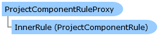

Collapse All Expand All Language Filter: All  Language Filter: Multiple  Language Filter: Visual Basic (Declaration) Language Filter: Visual Basic (Usage) Language Filter: C#  
---  
DriveWorks SDK Documentation  |   
---|---  
ProjectComponentRuleProxy Class   
[Members](topic6217.md)   
[DriveWorks.Engine Assembly](topic2156.md) > [DriveWorks.Components Namespace](topic6089.md) : ProjectComponentRuleProxy Class  
---  
  
Visual Basic (Declaration)    
Visual Basic (Usage)    
C# 

Glossary Item Box

Provides a base for inheriting from ProjectComponentRule. 

# Object Model

# Syntax

Visual Basic (Declaration)|   
---|---  
      
    
    Public MustInherit Class ProjectComponentRuleProxy 
       Inherits [ProjectComponentRule](topic6198.md)
       Implements [DriveWorks.Abstractions.IHasRule](topic5947.md), [DriveWorks.Abstractions.IHasRuleId](topic5957.md), [DriveWorks.Abstractions.IHasRuleVersionHistory](topic5975.md), [DriveWorks.Abstractions.INotifyRuleChanged](topic5987.md), Titan.Rules.Execution.IHasCustomName   
  
Visual Basic (Usage)| Copy Code  
---|---  
      
    
    Dim instance As [ProjectComponentRuleProxy](topic6216.md)  
  
C#|   
---|---  
      
    
    public abstract class ProjectComponentRuleProxy : [ProjectComponentRule](topic6198.md), [DriveWorks.Abstractions.IHasRule](topic5947.md), [DriveWorks.Abstractions.IHasRuleId](topic5957.md), [DriveWorks.Abstractions.IHasRuleVersionHistory](topic5975.md), [DriveWorks.Abstractions.INotifyRuleChanged](topic5987.md), Titan.Rules.Execution.IHasCustomName    
  
# Inheritance Hierarchy

System.Object  
System.MarshalByRefObject  
[DriveWorks.Components.ProjectComponentRule](topic6198.md)  
**DriveWorks.Components.ProjectComponentRuleProxy**  

# Requirements

**Target Platforms:** Please see DriveWorks software prerequisites.

# See Also

#### Reference

[ProjectComponentRuleProxy Members](topic6217.md)   
[DriveWorks.Components Namespace](topic6089.md)

